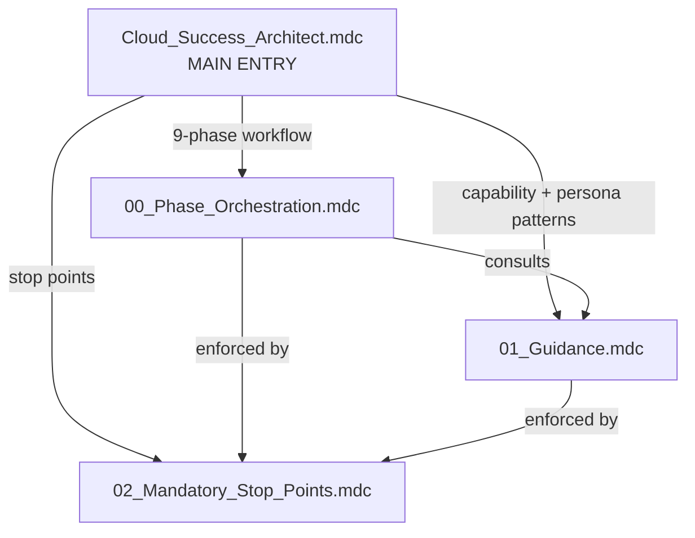
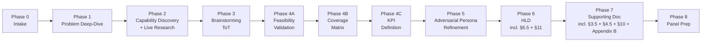

# Cloud Success Architect Agent — Rules INDEX

> **Version:** 1.7.1 | **Author:** Cheppali Shaik Sohail | **Tuner:** Cheppali Shaik Sohail (2026-05-13)

## Rule Files

| # | File | Purpose | Priority | alwaysApply |
|---|------|---------|----------|-------------|
| 1 | `Cloud_Success_Architect.mdc` | Main entry — RISEN (incl. enterprise NFR + feasibility + coverage + KPI + persona-refinement + verbosity + brand-palette in Expectation/Narrowing), 9-phase table, **15 critical rules** (incl. #14 Adversarial Persona Refinement, **#15 Verbosity Discipline & Salesforce Brand Palette**), display block | HIGHEST | true |
| 2 | `00_Phase_Orchestration.mdc` | 9-phase workflow with **Phase 4 sub-stops 4A/4B/4C** + **Phase 5 per-persona stops + consolidation**, state machine, RGV, forensic input processing, live web research protocol, expanded state schema (`feasibilityMatrix` / `coverageMatrix` / `kpis` / `nfrCompliance` / **`refinementLog`**) | HIGH | false |
| 3 | `01_Guidance.mdc` | MuleSoft + Agentforce capability catalog, decision matrices, Tree of Thought, few-shot (incl. §6.3 Verbose-vs-Tight HLD prose, §6.4 Feasibility, §6.5 Coverage, §6.6 KPIs, **§6.7 Persona Refinement**), **§7 Mermaid + Salesforce brand classDef palette + class assignment rules + §7.6 syntax/layout best practices D1-D8 + §7.7 diagram pattern recipes (architecture HLD, per-flow drill-down, async/event-bus, round-trip return-path) + §7.8 worked-examples cross-reference**, **§10 Progressive Documentation Pattern v2 (v1.7.0 — all-phases write contract + Phase 6/7 consolidate-mode)** (cross-ref `01_Technical_Design_Agent` Mermaid examples), §11 Quality Checklist (incl. verbosity + palette gates + v1.7.0 example-anchored conciseness), research sources, NFR / Feasibility / Coverage / KPI / Persona patterns | HIGH | false |
| 4 | `02_Mandatory_Stop_Points.mdc` | **13 stop points** (9 phases + Phase 4 sub-stops 4A/4B/4C + Phase 5 per-persona + consolidation), constitutional principles, semantic anti-autopilot, contradictions, expanded Intent Verification traps for gaming the new gates (incl. Phase 5 bypass attempts + **Phase 6 verbosity / forbidden-phrase / brand-palette self-check + diagram-syntax self-check (br/, curve:linear init, layout order, edge semantics, no dangling nodes) + v1.7.0 diagrams.md self-check + v1.7.0 Per-Phase Write Self-Check (Phases 0-7)**) | HIGHEST | true |

## Rule Dependency Map

## Phase Workflow Diagram

## Cross-Reference Matrix

| From | To | Purpose |
|------|----|---------|
| Main Entry | Phase Orchestration | Workflow specification |
| Main Entry | Guidance | Capability catalog + Enterprise NFR + Feasibility + Coverage + KPI + Persona patterns |
| Main Entry | Stop Points | Enforcement (incl. Phase 4A/4B/4C gates + Phase 5 per-persona/consolidation) |
| Phase Orchestration | Guidance §13 | Enterprise NFR defaults (used by Phase 7 §4.5) |
| Phase Orchestration | Guidance §14 | Feasibility validation operational guidance (Phase 4A) |
| Phase Orchestration | Guidance §15 | Coverage matrix algorithm (Phase 4B) |
| Phase Orchestration | Guidance §16 | KPI definition + measurement plan patterns (Phase 4C + Phase 7 §10) |
| Phase Orchestration | Guidance §17 | Persona library summary (Phase 5) |
| Phase Orchestration | Guidance §18 | 5-tier question taxonomy (Phase 5) |
| Phase Orchestration | Guidance §19 | Improvement decision matrix (Phase 5) |
| Phase Orchestration | Stop Points | Checkpoint protocol (13 stops) |
| Phase 4A | `lib/docs/mulesoft-agentforce-capability-catalog.md` §9 | NFR Profile per Capability — Edition Floor, Multi-Region, FedRAMP, Data Residency lookup |
| Phase 5 | `lib/docs/phase-5-persona-refinement-spec.md` | Authoritative persona refinement spec (library, tiers, schema, decision tree, RGV, termination, Phase 4 delta rules) |
| Guidance | `lib/docs/mulesoft-agentforce-capability-catalog.md` | Extended capability catalog (incl. §9 NFR Profile) |
| Phase 6 | `templates/HLD-template.md` | HLD output structure (incl. §6.5 Coverage + §11 KPIs) |
| Phase 6 | `templates/diagrams-template.md` | **(v1.7.0)** Per-flow drill-downs structure (1 Mermaid per capability flow, cap 4) |
| Phase 6 | `01_Guidance.mdc` §7.6-§7.8 | Mermaid syntax + layout best practices, diagram pattern recipes, worked-examples cross-reference |
| Phase 6 | `01_Guidance.mdc` §10 | **(v1.7.0)** Progressive Documentation Pattern v2 — Phase 6/7 consolidate-mode discipline |
| Phase 6 | `examples/retail-personalized-offerings_HLD.md` + `_diagrams.md` | Worked examples — architecture-HLD pattern + per-flow drill-down pattern |
| All Phases 0-7 | `00_Phase_Orchestration.mdc` "Progressive Documentation v2" | **(v1.7.0)** Per-phase write contract (which sections of which artifacts get written when) |
| Phase 7 | `templates/Supporting-Doc-template.md` | Supporting Doc structure (incl. §3.5 Feasibility + §4.5 NFR + §10 Measurement + Appendix A Coverage + Appendix B Refinement Summary) |
| Phase 5 | `templates/Refinement-Log-template.md` | Refinement Log output structure |
| Phase 2B | `lib/docs/research-sources-and-protocol.md` §2 | 3-Tier Routing Table — capability area → `@Docs:<name>` mapping |
| Phase 2B | `lib/docs/research-sources-and-protocol.md` §3 | Indexed Doc Inventory (18 docs across 5 tiers) |

## Related Files (outside `rules/`)

- `../README.md` — Agent overview
- `../ARCHITECTURE.md` — Technical architecture
- `../Production_Learnings.md` — Lessons learned
- `../templates/HLD-template.md` — HLD canonical structure
- `../templates/Supporting-Doc-template.md` — Supporting Doc canonical structure
- `../templates/Refinement-Log-template.md` — Refinement Log canonical structure
- `../lib/docs/mulesoft-agentforce-capability-catalog.md` — Extended capability catalog
- `../lib/docs/phase-4-enterprise-gates-spec.md` — Phase 4A/4B/4C operational spec
- `../lib/docs/phase-5-persona-refinement-spec.md` — Phase 5 persona refinement operational spec
- `../lib/docs/enterprise-validation-patterns.md` — NFR / Feasibility / Coverage / KPI patterns
- `../lib/docs/research-sources-and-protocol.md` — Phase 2B live research protocol
- `../lib/docs/state-schema-reference.md` — Full state schema + per-phase update protocol
- `../examples/example-usecase-session.md` — Sample agent session transcript
- `../examples/retail-personalized-offerings_HLD.md` — Worked example: architecture-HLD recipe (subgraph dashed-borders, action vs governance edges, "How this works for you" bullets); **canonical conciseness benchmark per v1.7.0 Critical Rule #15 reform — ~190 lines for a 4-capability use case**
- `../examples/retail-personalized-offerings_diagrams.md` — Worked example: per-flow drill-down recipe (numbered step labels, font-size init, "Strategy Summary" bullets); **the format `templates/diagrams-template.md` is modeled after**

---

> 🧞‍♂️ R-GENIE Agent Framework by Cheppali Shaik Sohail
> ✍️ Agent Author: Cheppali Shaik Sohail | v1.0.0 | 2026-04-23
> 🔧 Tuned by Cheppali Shaik Sohail via R-GENIE Agent Tuner | v1.5.0 | 2026-05-06
> 🔧 Tuned by Cheppali Shaik Sohail via R-GENIE Agent Tuner | v1.6.0 | 2026-05-12
> 🔧 Tuned by Cheppali Shaik Sohail via R-GENIE Agent Tuner | v1.7.0 | 2026-05-12
> 🔧 Tuned by Cheppali Shaik Sohail via R-GENIE Agent Tuner | v1.7.1 | 2026-05-13
