# Salesforce Solution Architect Agent — Architecture

> Internal design rationale: how the agent is built, why it's structured this way, and how each phase contributes to the final 12-section deliverable.

---

## Overview

The **Salesforce Solution Architect Agent** is a hybrid **Document Generator + Conversational** R-GENIE agent. It exists to solve a single, repeatable problem: producing **consistent, evidence-bound, audit-ready 12-section Salesforce Solution Architecture HLDs** for arbitrary scenarios — fast enough for pre-sales / RFP turnaround, rigorous enough for delivery handoff. Its primary output is a markdown document of ~400-700 lines that always contains the same twelve sections in the same order, regardless of scenario complexity.

The agent is built on **Pattern #20 v2 — Template-First / Per-Phase Write Contract**, a R-GENIE pattern designed for multi-phase agents producing long, structured deliverables. Pattern #20 v2 dictates that the **complete file skeleton is created up front** (Phase 0), then each subsequent phase **owns specific sections** and **writes its content directly to the file** between marker pairs. This eliminates two common failure modes for long-form generators: (a) section drift / order shuffling, and (b) "amnesia" where late phases lose context of earlier decisions. The skeleton acts as a contract; the markers act as a coordination protocol; the validation script enforces invariants the LLM is unreliable at.

The 9-phase workflow expands to **15 user touch-points** because three phases contain tightly-coupled sub-deliverables that warrant individual approval (Data Model + Lucidchart, Scalability + Reusability, and the final Risks + References + Polish triad). This was a deliberate design choice to honour the user's preference for "stop & approve after every section" while staying within R-GENIE's 10-phase architectural ceiling. The result: section-level granularity of approval, but with phases grouping logically related work.

---

## Workflow Steps

### Phase 0: Skeleton + Intake + Discovery → writes §1

**What**
Lays down the complete 12-section file skeleton with section markers, conducts scenario intake and 5-7 discovery questions, then writes §1 Business & Technical Context.

**How**
- Reads `templates/solution-architecture-style.yaml` and `templates/solution-architecture-template-guide.md`
- Generates `{slug}-solution-architecture.md` populated with all 12 section headers and `<!-- BEGIN/END §N -->` markers
- Runs structured intake (industry, scale, integration partner, regulatory context, NFRs)
- Activates **Conversational sub-mode** for clarifying Q&A (5-7 questions max)
- Writes §1 between markers, runs **R-G-V** (Recap-Guard-Verify) self-check, presents preview in chat
- Initialises state file `.salesforce-solution-architect-state.json`

**Why**
Pattern #20 v2 mandates the skeleton-first approach: it locks section order before any content is written, preventing the "drifting outline" failure mode. Discovery happens here (not later) because §1 anchors all downstream decisions — getting context wrong here propagates errors through every subsequent section.

**Approach**
Use a Conversational tone for discovery (questions one batch at a time, never overwhelming the user). Use a Document Generator tone for §1 itself (declarative, evidence-bound). Forensic Input Processing kicks in if the input is >500 lines (RFP/BRD upload).

---

### Phase 1: Recommended Architecture → writes §2

**What**
Produces a **trade-off comparison** of ≥2 candidate architectures and a justified recommendation.

**How**
- Drafts a comparison table: Option A vs. Option B (vs. C if relevant) across dimensions: complexity, scalability, cost, time-to-market, maintainability, vendor lock-in
- States the recommendation with **explicit "why this over that"** reasoning tied to Phase 0 inputs (especially scale + regulatory context)
- Writes §2 between markers, runs R-G-V, previews in chat

**Why**
The #1 mistake in solution architecture writing is **asserting a recommendation without comparison** — readers can't trust a choice they haven't seen rejected alternatives for. Forcing the trade-off table is a structural countermeasure to LLM Gap #8 (Sycophancy) and Gap #11 (Confident Hallucination): the model must defend its choice against named alternatives.

**Approach**
Decision matrix from `02_Guidance.mdc`. Reference Salesforce Industry Cloud capabilities concretely (e.g., "FSC for Insurance vs. custom build on Sales Cloud"). Anti-Sycophancy Directive applies if the user pushes back: stand firm without counter-evidence.

---

### Phase 2: Architecture Diagram (Mermaid) → writes §3

**What**
Produces a **Mermaid `flowchart LR`** showing systems, integrations, and data flows for the recommended architecture.

**How**
- Drafts the Mermaid block following the **10 Mermaid Standards** in `02_Guidance.mdc` (init directive with `curve: 'linear'`, `<br/>` for line breaks, styles at end, no special chars in node IDs, etc.)
- **Pre-emit Mermaid Render Guard** (in `03_Mandatory_Stop_Points.mdc`) runs syntactic self-check before write
- Writes §3 between markers, R-G-V, preview

**Why**
Mermaid diagrams are the single highest-failure-mode element in long-form architecture docs (rendering breaks silently, lines break wrong, special chars crash the parser). The **Render Guard self-check** is a structural countermeasure: every Mermaid block is validated against 10 known failure patterns before being committed to file.

**Approach**
Show **systems as nodes** (Salesforce, integration tier, partner system, channels), **flows as labelled arrows** (sync vs. async clearly marked). Always include the init directive header. Mention that the user should render-preview before approving.

---

### Phase 3: Data Model + Lucidchart → writes §4 + §5

**What**
Designs the **Salesforce data model** (objects, key fields, relationships, sharing model) and produces **text-based Lucidchart instructions** for the visual ERD.

**How**
- Sub-stop **3a (§4 Data Model)**: lists objects (standard + custom), key fields with types, lookup vs. master-detail, sharing/visibility model. Preview-approve-write.
- Sub-stop **3b (§5 Lucidchart Instructions)**: step-by-step text instructions following Lucidchart conventions (entity boxes with field lists, crow's-foot relationship notation, swim-lane suggestions for multi-system models). Preview-approve-write.

**Why**
Salesforce data model design has many reversible-but-painful decisions (lookup vs. master-detail, sharing model choice, field types). Splitting §4 and §5 into sub-stops gives the user a chance to course-correct before the visual is locked in. **Lucidchart instead of Mermaid** because data models with 8+ entities and complex relationships render poorly in Mermaid; Lucidchart is the SFDC architect community standard.

**Approach**
Reference Salesforce object naming conventions (`__c` for custom). Be explicit about **why** master-detail vs. lookup for each relationship. Lucidchart instructions are **text-only** (no embedded images) — they describe what the user should draw.

---

### Phase 4: Integration & Event Pattern → writes §6

**What**
Specifies the **integration pattern** (sync REST, async Platform Events, CDC, file-based, etc.) and the **event/messaging contract** between Salesforce and external systems.

**How**
- Names the pattern explicitly (e.g., "Asynchronous Pub-Sub via Platform Events with retry-on-failure")
- Lists events with payload schemas (in YAML or pseudo-JSON, not full code)
- Documents the integration tier (MuleSoft / Heroku / direct Composite API / etc.) and **why**
- Preview-approve-write between markers

**Why**
Integration pattern is where most production incidents originate. Forcing **explicit pattern naming** + **payload schema** + **failure mode** in this section is a structural countermeasure to the "we'll figure it out in detailed design" anti-pattern.

**Approach**
Use the integration decision matrix from `02_Guidance.mdc` to choose the pattern. State the event contract in YAML (architecture-level — no actual transformation code, that belongs to a different agent).

---

### Phase 5: Automation & Orchestration → writes §7

**What**
Documents the **automation layer**: Flow vs. Apex Trigger vs. Process Builder (deprecated) vs. external orchestrator, plus the **orchestration sequence** for end-to-end processes.

**How**
- States automation choices per object/process with **why** (e.g., "Flow over Apex Trigger here because no bulk DML > 200 records and business analyst maintainability")
- Provides a sequence diagram or numbered orchestration flow (text-based)
- Preview-approve-write

**Why**
"Apex vs. Flow" is one of the most contested SFDC architecture decisions; agents that don't enforce explicit reasoning here produce lukewarm docs that get rejected in design review.

**Approach**
Use the Automation decision matrix from `02_Guidance.mdc`. Mention governor limits when relevant (architecture-level only — no actual Apex code).

---

### Phase 6: Security & Compliance → writes §8

**What**
Documents **identity & access** (SSO, profiles, perm sets), **data protection** (Shield/PE/event monitoring, field encryption), **compliance posture** (HIPAA / GDPR / PCI / SOC2 / NAIC as applicable), and **audit trail** strategy.

**How**
- Maps Phase 0 regulatory inputs to **specific Salesforce features**
- States retention + deletion policy
- Documents PII/PHI fields explicitly
- Preview-approve-write

**Why**
Compliance handwaving ("we'll be HIPAA compliant") is a top reason architecture docs fail audit review. Forcing **named features mapped to named regulations** is the structural countermeasure.

**Approach**
Reference Salesforce Shield, Event Monitoring, Field Audit Trail, Encryption at Rest by name. Tie each to the specific regulatory clause it addresses.

---

### Phase 7: Scalability + Reusability → writes §9 + §10

**What**
Sub-stop **7a (§9)**: Quantitative scalability analysis with **explicit arithmetic** for TPS, daily volume, storage growth, governor limit headroom. Sub-stop **7b (§10)**: Reusability story — what components are scenario-specific vs. productisable.

**How**
- §9 numeric verification example: `50,000 claims/day ÷ 86,400 sec = 0.58 TPS avg → peak factor 5x = 2.9 TPS` — showing the math, not just the result. Validation script enforces this.
- §10 lists reusable components (data model patterns, integration templates, event schemas) with reuse-readiness scoring.
- Each sub-stop preview-approve-write.

**Why**
**Gap #13 (Numerical Dyslexia)** is the LLM's worst weakness on architecture docs. Forcing explicit arithmetic is a structural countermeasure: the user can verify by reading. Splitting reusability into its own sub-stop forces the architect to think productisation, not just bespoke design.

**Approach**
Show every calculation. Use bullets like `Volume → ÷ seconds → avg TPS → × peak factor → peak TPS → vs. governor limit X`. The validation script greps for arithmetic patterns and fails if §9 has unsupported numeric claims.

---

### Phase 8: Risks + References + CONSOLIDATE & POLISH → writes §11 + §12 + final polish

**What**
Sub-stop **8a (§11)**: Risk register (Risk → Probability → Impact → Mitigation → Owner). Sub-stop **8b (§12)**: References (Salesforce docs, integration partner docs, regulatory sources, NIST/OWASP if applicable). Sub-stop **8c**: Run validation script. Sub-stop **8d**: Consolidate & Polish — final read-through, fix marker remnants, normalise terminology, verify cross-section consistency.

**How**
- §11: tabular risk register with named owners and concrete mitigations
- §12: hyperlinked references with version dates
- Validation script: run `node lib/scripts/validate-solution-doc.js {file}`; surface any failures
- Polish: read entire file end-to-end, fix any cross-section terminology drift (e.g., "claim" vs. "Claim" vs. "FNOL Case"), remove residual `TODO`/`{placeholder}` strings, ensure markers are stripped from output

**Why**
**Pattern #20 v2 mandates a final Consolidate & Polish phase** because per-phase writes accumulate small inconsistencies that only become visible in end-to-end reading. The validation script catches structural failures (missing sections, broken Mermaid, missing arithmetic) the LLM is unreliable at detecting in self-review.

**Approach**
Treat polish as a separate cognitive activity — read for consistency, not for content. The script is a deterministic backstop; polish is a craftsperson's pass.

---

## Flow Diagram

```mermaid
%%{init: {'flowchart': {'curve': 'linear'}}}%%
flowchart LR
    P0["Phase 0<br/>Skeleton + Intake<br/>+ Discovery<br/>→ §1"] --> P1
    P1["Phase 1<br/>Recommended<br/>Architecture<br/>→ §2"] --> P2
    P2["Phase 2<br/>Architecture<br/>Diagram<br/>→ §3"] --> P3
    P3["Phase 3<br/>Data Model +<br/>Lucidchart<br/>→ §4 + §5"] --> P4
    P4["Phase 4<br/>Integration +<br/>Event Pattern<br/>→ §6"] --> P5
    P5["Phase 5<br/>Automation +<br/>Orchestration<br/>→ §7"] --> P6
    P6["Phase 6<br/>Security +<br/>Compliance<br/>→ §8"] --> P7
    P7["Phase 7<br/>Scalability +<br/>Reusability<br/>→ §9 + §10"] --> P8
    P8["Phase 8<br/>Risks + Refs +<br/>CONSOLIDATE<br/>→ §11 + §12 + Polish"] --> DONE
    DONE["Validated<br/>HLD<br/>~400-700 lines"]

    classDef phase fill:#E3F2FD,stroke:#1976D2,stroke-width:2px,color:#0D47A1
    classDef done fill:#C8E6C9,stroke:#388E3C,stroke-width:2px,color:#1B5E20
    class P0,P1,P2,P3,P4,P5,P6,P7,P8 phase
    class DONE done
```



---

## Key Patterns Embedded

| Pattern | Where Applied | Why |
|---------|---------------|-----|
| **#20 v2 Template-First / Per-Phase Write Contract** | All phases — skeleton in P0, per-phase writes thereafter, polish in P8 | Eliminates section drift + late-phase amnesia in long-form docs |
| **RISEN Framework** | `Salesforce_Solution_Architect.mdc` main entry | Standard R-GENIE prompt structure |
| **Forensic Input Processing** | `01_Phase_Orchestration.mdc` (kicks in for inputs >500 lines) | Mitigates Attention Drift (Gap #1) and Positional Bias (Gap #2) on RFP-scale inputs |
| **R-G-V (Recap-Guard-Verify)** | Every phase before preview | Per-phase self-check before user sees output |
| **Anti-Sycophancy Directive** | `02_Guidance.mdc` + `03_Mandatory_Stop_Points.mdc` | Stand firm on recommendations without counter-evidence (Gap #8) |
| **Numeric Verification Mandate** | §9 — enforced by validation script | Counter Gap #13 Numerical Dyslexia |
| **Tool-First Content Mutation** | All file writes use IDE tools, never shell | Counter Gap #16 IDE Edit-Size Failure Mode |
| **Progressive File Writing** | Edits ≤300 lines per call | Counter Gap #16 |
| **Few-Shot Examples** | `02_Guidance.mdc` BAD/GOOD pairs | Anchor model behaviour on top-3 mistakes |
| **Lean Script Principle** | Single validator at `lib/scripts/validate-solution-doc.js` | Only structural invariants the LLM is unreliable at |
| **Verbosity Anchoring** | `examples/01_fnol_insurance_guidewire/...md` | Calibrates output length (~400-700 lines) |

---

## State Management

**File**: `project/output_salesforce_solution_architect/.salesforce-solution-architect-state.json`

**Schema** (excerpt):
```json
{
  "scenarioSlug": "fnol-insurance-guidewire",
  "currentPhase": 4,
  "phaseStatuses": { "phase0": "COMPLETED", "phase1": "COMPLETED", ... },
  "intake": { "industry": "Insurance", "scale": "50K claims/day", ... },
  "discoveryAnswers": { ... },
  "decisions": {
    "architecture": "Asynchronous Pub-Sub via Platform Events",
    "integrationPartner": "Guidewire ClaimsCenter",
    "automationLayer": "Flow + Platform Events"
  },
  "outputFile": "fnol-insurance-guidewire-solution-architecture.md",
  "lastValidationResult": null
}
```

**Why stateful**:
- Allows **cross-session resume** for multi-day RFP responses
- Stores **decisions** so later phases can reference earlier choices (eliminates contradiction risk)
- Enables **future learning** (Production_Learnings.md feeds back from these states)

**Update protocol**:
- Every phase completion writes to state file before user approval
- Validation result captured after Phase 8 script run
- Never deleted automatically (user must clean up stale states manually)

---

## Error Recovery

| Failure Mode | Recovery |
|--------------|----------|
| Mermaid render breaks in §3 | Render Guard catches before write; if it slips through, re-enter Phase 2 with alternative syntax |
| Validation script fails in Phase 8 | Surface specific failure; re-enter the responsible phase (e.g., §9 arithmetic missing → re-enter Phase 7) |
| User aborts mid-run | State file preserves position; resume by re-activating with the same scenario slug |
| Section marker accidentally deleted | Phase 8 polish detects orphan content; restore marker before final read |
| Cross-section contradiction (e.g., §2 says async but §6 says sync) | Phase 8 polish + validation script's "entity consistency" check catches; re-enter the source-of-truth phase |
| Input >500 lines | Forensic Input Processing engages automatically (mind map → section RGV → positional bias scan) |

---

## Why Not Just Use a Template?

A static template gives you 12 headers but no enforcement of:
- **Trade-off comparison** in §2 (LLM left to its own devices defaults to picking one and asserting)
- **Numeric arithmetic** in §9 (LLM defaults to "approximately X TPS")
- **Compliance feature mapping** in §8 (LLM defaults to "we will comply")
- **Marker hygiene** (templates don't strip themselves on completion)
- **Cross-section consistency** (no template polishes itself)

The agent enforces all of these via rules + script + per-phase contract. The template is the *substrate*; the agent is the *craftsperson*.

---

> 🧞‍♂️ R-GENIE Agent Framework | Salesforce Solution Architect Agent v1.0.0 | 2026-05-13
