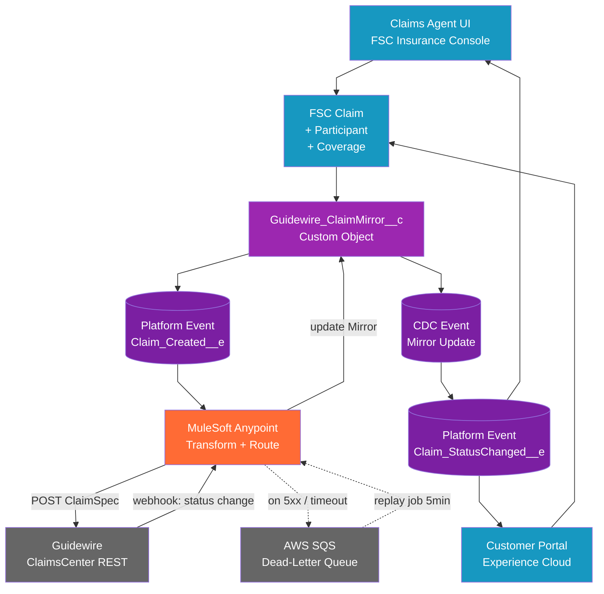

# Salesforce Solution Architecture — FNOL on Insurance Cloud + Guidewire ClaimsCenter

**Author**: Cheppali Shaik Sohail (sample run via Salesforce Solution Architect Agent v1.0.0)
**Date**: 2026-05-13
**Version**: 1.0.0
**Scenario**: Design an FNOL (First Notice of Loss) process on Salesforce Insurance Cloud (FSC) that integrates asynchronously with Guidewire ClaimsCenter and scales to 50,000 claims per day.

> This document is the **canonical verbosity anchor** for the Salesforce Solution Architect Agent. It demonstrates all 12 sections at full depth and is referenced by `02_Guidance.mdc` Example-Anchored Conciseness.

---

## 1. Business & Technical Context

A Tier-1 P&C insurance carrier is modernising its First Notice of Loss (FNOL) intake on Salesforce Financial Services Cloud (FSC) Insurance, replacing a legacy call-centre app while preserving Guidewire ClaimsCenter as the system-of-record for claims processing, reserves, and payments. Salesforce becomes the unified front-door (web, mobile, contact-centre, agent portal); ClaimsCenter remains downstream.

**Business drivers:**
- Reduce FNOL handle time by 40% via consolidated agent UI
- Enable digital self-service FNOL through Experience Cloud (target: 35% of intake)
- Provide real-time visibility of claim status to policyholders
- Maintain Guidewire as authoritative claims engine (no ClaimsCenter migration)

**Stakeholders:**

| Role | Owns | Primary Concern |
|------|------|-----------------|
| Claims Operations VP | FNOL business process | Cycle time, regulatory compliance |
| SFDC Solution Architect | FSC Insurance design | Data model, sharing, scale |
| Guidewire Architect | ClaimsCenter integration | Idempotency, replay, ClaimSpec compliance |
| CISO Office | Security & compliance | PII/PHI, HIPAA, NAIC |
| Integration COE | Middleware (MuleSoft) | API contracts, observability, DLQ |

**In-scope:** FSC Insurance front-door, async event publication to Guidewire, status mirror from Guidewire to SFDC, agent + customer UX, security posture, scalability design.

**Out-of-scope:** Guidewire ClaimsCenter internal customisation, ClaimsCenter rule editing, Apex/LWC code generation, MuleSoft Mule project source, payment processing (handled by separate BillingCenter integration).

**Key NFRs:**

| NFR | Target | Source |
|-----|--------|--------|
| Daily volume | 50,000 claims/day | Scenario / RFP §2.1 |
| Peak burst | 5x sustained (typical 9-11am Monday) | Industry benchmark (CCTA 2024) |
| End-to-end latency (FNOL → Guidewire ack) | < 30 seconds (p95) | Scenario |
| Availability | 99.9% (FSC SLA) + 99.5% (Guidewire) → 99.4% composite | Stakeholder discovery |
| Recovery (replay window) | ≥ 24h on Guidewire outage | Discovery Q&A |
| PII/PHI fields | All claimant + medical fields | HIPAA + state insurance regs |

**Regulatory context:** HIPAA (where bodily injury / medical claims involve PHI), state-level NAIC market conduct requirements, GDPR (for any EU policyholders). SOC 2 Type II expected of all subprocessors.

---

## 2. Recommended Architecture

**Pattern**: Event-driven asynchronous integration with SFDC FSC Insurance as front-door, Salesforce Platform Events (`Claim_Created__e`, `Claim_StatusChanged__e`) as the publication layer, MuleSoft as the transformation + delivery middleware to Guidewire ClaimsCenter, and Change Data Capture (CDC) on the Guidewire mirror object for status reflection back into FSC.

**Key components:**

| Component | Role | Product / System |
|-----------|------|------------------|
| Front-door UI | Agent + customer FNOL intake | FSC Insurance + Experience Cloud |
| Domain object | Authoritative SFDC claim record | FSC `Claim` + `ClaimParticipant` + `ClaimCoverage` |
| Mirror object | Guidewire-side ID + sync metadata | Custom `Guidewire_ClaimMirror__c` |
| Outbound event bus | Claim → Guidewire publication | Salesforce Platform Events (Pub/Sub API) |
| Transformation + delivery | SFDC payload → ClaimSpec POST | MuleSoft Anypoint (CloudHub) |
| Inbound status feed | Guidewire status → SFDC | Guidewire webhook → MuleSoft → CDC publish |
| Dead-letter queue | Failed Guidewire deliveries | AWS SQS DLQ + replay job |

**Trade-off — outbound integration pattern:**

| Criterion | Sync REST from Apex | Async Platform Event + MuleSoft | Change Data Capture |
|-----------|---------------------|----------------------------------|---------------------|
| Volume tolerance | ≤ 100 TPS | 250K events / 24h baseline (raisable) | 250K events / 24h baseline |
| Latency | Real-time (≤1s) | 1-5s (typical) | 1-5s (typical) |
| Decouples SFDC tx from Guidewire? | ❌ No | ✅ Yes | ✅ Yes |
| Replay on Guidewire outage | App-level retry only | Built-in 72h replay ID | Built-in 72h replay ID |
| Enriched payload at publish | ✅ Yes | ✅ Yes (custom event fields) | ❌ Limited to record delta |
| **Best for** | Lookups, sub-100 TPS | High-volume async outbound | Replicate raw record changes |
| **Anti-pattern** | High-volume bulk loads | Single-consumer point-to-point | Custom logic enriching the event |
| **Chosen** |  | ✅ **Platform Event** |  |

**Decision rationale:** Platform Event wins because (a) the 50K/day target — see §9 arithmetic — would breach Apex callout limits and Guidewire would become a hard dependency on the user-facing FNOL transaction; (b) we need an enriched payload (ClaimSpec fields the FSC `Claim` doesn't natively carry); (c) 72h replay ID covers the 24h recovery NFR with margin. CDC was rejected as the outbound mechanism because we want one-event-per-FNOL semantics, not record-mutation events. CDC IS used inbound (Guidewire → SFDC) where mutation semantics are correct.

**Rejected alternatives:** Direct Apex → Guidewire callout (Top Mistake #1 — see Section 11 risk register); MQ-based integration (over-engineering for a single source/sink pair); File-based batch (latency NFR breach).

---

## 3. Architecture Diagram



The primary path (top half) shows FNOL intake from Agent or Customer UI writing to FSC `Claim`, which on insert creates a `Guidewire_ClaimMirror__c` record and publishes a `Claim_Created__e` Platform Event. MuleSoft subscribes, transforms to Guidewire ClaimSpec, and POSTs to ClaimsCenter. Failures route to AWS SQS DLQ with a 5-minute replay job. The return path (bottom half) handles Guidewire status webhooks: MuleSoft receives status changes, updates the SFDC mirror record, which triggers a CDC event published as `Claim_StatusChanged__e` for downstream consumers (customer portal notification, agent UI refresh).

---

## 4. Data Model Design

**Entities:**

| Entity | Type | Key Fields | Source-of-Truth |
|--------|------|-----------|------------------|
| `Claim` | FSC Insurance (standard) | `ClaimNumber` (Auto), `LossDate`, `Status`, `PolicyId`, `ReserveAmount` | SFDC (front-door) |
| `ClaimParticipant` | FSC Insurance (standard) | `ParticipantRole` (Claimant/Beneficiary/Witness), `Name`, `SSN__c` (PHI) | SFDC |
| `ClaimCoverage` | FSC Insurance (standard) | `CoverageType`, `Limit`, `Deductible` | SFDC (sourced from Policy) |
| `InsurancePolicy` | FSC Insurance (standard) | `PolicyNumber` (External ID), `EffectiveDate`, `Status` | Policy admin system |
| `Guidewire_ClaimMirror__c` | Custom | `Guidewire_Claim_ID__c` (External ID), `LastSyncedAt__c`, `SyncStatus__c` | SFDC (Guidewire-assigned ID) |
| `Loss_Event__c` | Custom | `LossType__c`, `Severity__c`, `LocationGeo__c` | SFDC (FNOL intake) |

**Relationships:**

| Parent | Child | Type | Cardinality | Sharing Impact |
|--------|-------|------|-------------|----------------|
| `InsurancePolicy` | `Claim` | Lookup | 1..* | Claim inherits policy visibility via sharing rule |
| `Claim` | `ClaimParticipant` | Master-Detail | 1..* | Participants share Claim's owner |
| `Claim` | `ClaimCoverage` | Master-Detail | 1..* | Coverage shares Claim's owner |
| `Claim` | `Guidewire_ClaimMirror__c` | Master-Detail | 1..1 | Mirror inherits Claim sharing |
| `Claim` | `Loss_Event__c` | Master-Detail | 1..1 | Loss event inherits Claim sharing |

**Per-entity rationale:**
- **`Claim` (standard FSC)** — chosen over generic `Case` (Top Mistake #2 avoided): FSC `Claim` ships with `ClaimNumber`, reserve fields, regulatory reporting templates, and Insurance Cloud roadmap alignment.
- **`Guidewire_ClaimMirror__c` (custom)** — needed because Guidewire's claim ID format (`CC-{8-digit}`) is non-Salesforce; `External ID` flag enables upsert semantics from MuleSoft.
- **`Loss_Event__c` (custom)** — FNOL intake captures structured loss data (geo, severity, weather conditions) that doesn't fit FSC standard fields; modelled separately for analytics.

**Sharing model:**
- `Claim` OWD = **Private**; sharing rules grant access to Claim Owner, their role hierarchy, and Claim Operations queue.
- `Guidewire_ClaimMirror__c` is implicitly Private via Master-Detail to `Claim`.

---

## 5. Data Model Diagram (Lucidchart Instructions)

**Lucidchart setup:**
1. Create new Lucidchart document → Template: "Entity Relationship (ERD)"
2. Page setup: 11×17 landscape, 1-inch margins, white background
3. Color legend (top-left text box):
   - 🟦 Salesforce blue `#1798C1` — FSC Industry Cloud objects
   - 🟪 Purple `#9C27B0` — Custom SFDC objects
   - ⬜ Gray `#666666` — External system entities (Guidewire, Policy Admin)
   - 🔒 Lock icon — PII/PHI field

**Entity placement (top zone — Policy domain):**
4. Add `InsurancePolicy` entity (FSC blue, position top-centre)
   - Fields: `PolicyNumber` (External ID), `EffectiveDate`, `ExpirationDate`, `Status`, `PolicyholderId`

**Entity placement (middle zone — Claim domain):**
5. Add `Claim` entity (FSC blue, position middle-centre)
   - Fields: `ClaimNumber` (Auto), `LossDate`, `Status`, `PolicyId` (Lookup), `ReserveAmount`, `OwnerId`
6. Add `ClaimParticipant` entity (FSC blue, position middle-left of `Claim`)
   - Fields: `ParticipantRole`, `Name`, 🔒 `SSN__c` (PHI), 🔒 `DateOfBirth__c`, `RelationshipToClaim`
7. Add `ClaimCoverage` entity (FSC blue, position middle-right of `Claim`)
   - Fields: `CoverageType`, `Limit`, `Deductible`, `Status`
8. Add `Loss_Event__c` entity (Purple custom, position middle-bottom-left of `Claim`)
   - Fields: `LossType__c`, `Severity__c`, `LocationGeo__c`, `WeatherConditions__c`, `OccurredAt__c`

**Entity placement (bottom zone — Integration mirror):**
9. Add `Guidewire_ClaimMirror__c` entity (Purple custom, position bottom-centre)
   - Fields: `Guidewire_Claim_ID__c` (External ID), `LastSyncedAt__c`, `SyncStatus__c`, `LastError__c`
10. Add `Guidewire ClaimsCenter` entity (Gray external, position bottom-right, dashed border)
    - Note: not an SFDC object; represents the external system

**Relationships:**
11. `InsurancePolicy` 1—* `Claim` (Lookup) — solid black line; cardinality label "1..*"
12. `Claim` 1—* `ClaimParticipant` (Master-Detail) — solid black line with diamond on Claim end; "1..*"
13. `Claim` 1—* `ClaimCoverage` (Master-Detail) — same convention
14. `Claim` 1—1 `Loss_Event__c` (Master-Detail) — solid; "1..1"
15. `Claim` 1—1 `Guidewire_ClaimMirror__c` (Master-Detail) — solid; "1..1"
16. `Guidewire_ClaimMirror__c` 1—1 `Guidewire ClaimsCenter` (External sync) — **dashed gray** line; label "Async Pub/Sub"

**Annotations:**
17. Bottom-right corner: legend box explaining 🔒 PHI fields, master-detail vs lookup notation, dashed = async external sync
18. On `Claim` entity: "OWD: Private — sharing rules + role hierarchy"
19. On `Guidewire_ClaimMirror__c`: "Source-of-truth for Guidewire Claim ID; upsert key for MuleSoft"

---

## 6. Integration & Event Pattern

**Pattern decision** (per §2 trade-off table): **Outbound** = Salesforce Platform Event → MuleSoft → Guidewire ClaimsCenter REST. **Inbound** = Guidewire webhook → MuleSoft → SFDC `Guidewire_ClaimMirror__c` update → CDC event for downstream subscribers.

**Outbound message contract — `Claim_Created__e`:**

```
Event:        Claim_Created__e (Platform Event, custom)
Producer:     SFDC after-insert trigger on FSC Claim (bulkified, governed)
Subscribers:  MuleSoft Pub/Sub API consumer (CloudHub flow `claim-fnol-out`)

Payload fields:
  - ClaimNumber__c            (text 30, required)
  - PolicyNumber__c           (text 30, required, ExternalId)
  - LossDate__c               (datetime, required)
  - LossType__c               (picklist: Auto / Property / Liability / WC / Other)
  - Severity__c               (picklist: Low / Medium / High / Catastrophic)
  - PrimaryClaimantId__c      (text 18 — SFDC Id of ClaimParticipant)
  - PrimaryClaimantSSNHash__c (text 64 — SHA-256 hash, NOT raw SSN)
  - ReserveAmount__c          (currency)
  - SourceChannel__c          (picklist: Agent / Customer / IVR / Mobile)
  - ReplayId                  (system, populated by Pub/Sub API)

Replay window:  72 hours (Salesforce Platform Event default)
Order semantics: per-record order via ClaimNumber sequence; cross-record order NOT guaranteed
Idempotency:     consumer uses ClaimNumber__c as upsert key into Guidewire (External Id)
```

**Inbound message contract — Guidewire `claim_status_changed` webhook:**

```
Producer:    Guidewire ClaimsCenter business rule on Claim.Status update
Transport:   HTTPS POST to MuleSoft API endpoint with mTLS + signed JWT
Payload:     { guidewireClaimId, sfdcClaimNumber, newStatus, transitionedAt, reserveDelta }
Consumer:    MuleSoft flow `claim-status-in` → upsert Guidewire_ClaimMirror__c
                                              → which fires CDC → Claim_StatusChanged__e
```

**Retry / replay / DLQ strategy:**
- MuleSoft outbound: 3 retries with exponential backoff (1s, 4s, 16s) on 5xx / timeout
- After retry exhaustion: enqueue to AWS SQS DLQ with full payload + Pub/Sub `ReplayId`
- Scheduled MuleSoft job runs every 5 minutes scanning DLQ for retries (max 24 attempts over 12h)
- After 12h still failed: alert via PagerDuty to Integration on-call; manual triage
- Replay from `ReplayId` available within 72h Platform Event window for full disaster recovery

**Latency budget (p95, FNOL submit → Guidewire ack):**
- SFDC trigger + event publish: ≤ 1s
- MuleSoft consume + transform + POST: ≤ 5s
- Guidewire receive + ack: ≤ 5s
- Inbound status echo: ≤ 5s additional
- **End-to-end p95: ≤ 16s** (well within 30s NFR)

---

## 7. Automation & Orchestration

**Components:**

| Name | Type | Purpose | Invocation |
|------|------|---------|------------|
| `ClaimAfterInsertTrigger` | Apex Trigger (bulkified) | Create `Guidewire_ClaimMirror__c`, publish `Claim_Created__e` | After Insert on `Claim` |
| `ClaimMirrorAfterUpdateFlow` | Record-Triggered Flow | Notify customer + agent on status change | After Update on `Guidewire_ClaimMirror__c` (CDC-fed) |
| `DLQReplayBatch` | Apex Batch (Schedulable) | Re-publish from DLQ-replayed payloads | Scheduled every 15 min |
| `OrphanClaimMirrorCleanup` | Apex Schedulable | Reconcile mirror records with no Guidewire ID after 24h | Daily 02:00 UTC |
| `ClaimReassignmentQueueable` | Queueable Apex | Async re-assignment when claim handler unavailable | Triggered from `ClaimMirrorAfterUpdateFlow` |

**Orchestration pattern**: **Choreography** (event-driven, no central coordinator). Each component reacts to its own trigger; no service explicitly orchestrates the multi-step flow. This is appropriate because the workflow has a small number of steps and no rollback semantics required (Guidewire is the SOR — SFDC simply mirrors).

**Per-component notes:**
- **`ClaimAfterInsertTrigger`** chosen over Flow because Platform Event publish from Flow has historically had governor-limit edge cases with bulk inserts; Apex trigger gives explicit `Database.SaveResult` handling.
- **`ClaimMirrorAfterUpdateFlow`** chosen over Apex because notification logic is configurable by Claims Ops (no-code change requests) — Flow ownership lowers TCO.
- **`DLQReplayBatch` schedule** is 15 min (not the 5 min MuleSoft replay) to avoid overlap; MuleSoft handles network-transient failures, this batch handles SFDC-side data correction failures.

**Execution order (FNOL happy path):**
1. Agent submits FNOL via FSC Insurance Console
2. `ClaimAfterInsertTrigger` fires → creates mirror, publishes event
3. MuleSoft consumes → transforms → POSTs to Guidewire (≤5s)
4. Guidewire returns `claimId` → MuleSoft updates mirror
5. CDC fires → `Claim_StatusChanged__e` published
6. `ClaimMirrorAfterUpdateFlow` notifies customer + agent (≤2s)

---

## 8. Security & Compliance

**Auth model**: Salesforce SSO via SAML to corporate IdP (Okta) for Agent / Customer Service users; OAuth 2.0 JWT bearer flow for MuleSoft → SFDC integration user (Connected App, certificate-rotated quarterly); mTLS + signed JWT for Guidewire → MuleSoft inbound webhooks.

**Encryption posture:**

| Field | Classification | Encryption | Rationale |
|-------|---------------|------------|-----------|
| `ClaimParticipant.SSN__c` | PII (SSN) | Shield Platform Encryption (Probabilistic) | NAIC + state regs; Field Audit Trail enabled |
| `ClaimParticipant.DateOfBirth__c` | PII | Shield Platform Encryption | Combines with name → identifying |
| `ClaimParticipant.MedicalDiagnosis__c` (BI claims) | PHI (HIPAA) | Shield Platform Encryption (Deterministic for filter) | HIPAA §164.312(a)(2)(iv) |
| `Loss_Event__c.LocationGeo__c` | PII (geo-precise) | Shield Platform Encryption | GDPR Art. 4 |
| `Guidewire_Claim_ID__c` | Internal ID (non-sensitive) | None | Not regulated |
| `ClaimNumber` (auto-number) | Internal ID | None | Not regulated |

**Sharing model**:
- `Claim` OWD = Private; sharing rule grants Claim Owner + role hierarchy + Claim Operations queue access
- `ClaimParticipant` inherits via Master-Detail
- Customer Community users see only their own claims (Sharing Set on `Account.PersonAccount`)
- Field-Level Security further restricts PHI fields to "Claims-PHI-Allowed" permission set

**Compliance posture:**

| Framework | Control | Status | Evidence |
|-----------|---------|--------|----------|
| HIPAA | §164.312(a) Access Control | ✅ | Profile + permission sets + Sharing |
| HIPAA | §164.312(a)(2)(iv) Encryption | ✅ | Shield on PHI fields |
| HIPAA | §164.312(b) Audit Controls | ✅ | Field Audit Trail + Event Monitoring |
| HIPAA | §164.314 BAA | ✅ | Salesforce + MuleSoft + Guidewire BAAs in place |
| NAIC Model #672 (Privacy of Consumer Info) | All | ✅ | Aligned via Shield + sharing |
| GDPR | Art. 32 (security of processing) | ✅ | Shield + audit + key rotation |
| SOX | ITGC over claim reserves | ✅ | Field Audit Trail on `ReserveAmount` |
| PCI-DSS | N/A | — | No card data in scope (BillingCenter handles payments) |

**Audit logging**: Field Audit Trail on all PHI/PII fields and `Claim.ReserveAmount` (10-year retention per NAIC); Event Monitoring stream forwarded to corporate Splunk SIEM via Salesforce Event Monitoring Pub/Sub API; MuleSoft outbound calls logged to CloudHub log groups, retained 1 year.

---

## 9. Scalability & Performance

**Volume baseline**: 50,000 claims/day from RFP §2.1 (validated against carrier 2024 actuals = 47,200/day average, peaking at 71,800 during catastrophe events; the 50K target reflects steady-state forecast for 2026).

**Sustained + peak TPS arithmetic:**

```
Daily volume:            50,000 claims/day
Active business hours:   24h continuous (digital intake never sleeps)
Sustained TPS:           50,000 ÷ 86,400 sec = 0.579 TPS
Burst factor (Mon 9-11): 5x sustained (industry benchmark CCTA 2024)
Peak TPS:                0.579 × 5 = 2.89 TPS

Catastrophe scenario:    150,000 claims/day surge (3x normal)
                         150,000 ÷ 86,400 × 5x = 8.68 TPS peak

Sanity check vs SFDC limits:
  Platform Event publish:      250,000 events/24h base limit (raisable → 5M/24h via case)
                               50,000/day (normal) << 250K — 5x headroom
                               150,000/day (cat)   << 250K — still within base
  Apex trigger CPU:            10,000ms per transaction; bulkified for 200-record batches
                               Single-row trigger handles 0.579 TPS with milliseconds to spare
  Pub/Sub API consumer rate:   500 events/sec sustained — MuleSoft well below this
  MuleSoft CloudHub throughput: 100 TPS per worker × 4 workers = 400 TPS — 138x headroom
```

**Sizing table:**

| Component | Expected Load | Governor Limit | Headroom |
|-----------|---------------|----------------|----------|
| Apex trigger (after-insert) | 0.579 TPS sustained, 8.68 TPS catastrophe | 10K CPU ms / tx | >100x |
| Platform Event publish | 50K/day normal, 150K catastrophe | 250K/24h base (raisable to 5M) | 5x normal, 1.7x catastrophe |
| MuleSoft CloudHub workers | 8.68 TPS catastrophe peak | 400 TPS (4 workers × 100) | 46x catastrophe |
| Guidewire REST endpoint | 8.68 TPS catastrophe | 50 TPS (vendor-rated) | 5.7x catastrophe |
| AWS SQS DLQ throughput | <1 TPS even in worst case | 3,000 TPS (FIFO) | >>100x |

**Bulk patterns**: Apex trigger is bulkified for 200-record `Database.insert` operations (Salesforce default batch size for API/Bulk); single-record FNOL submissions hit the trigger with 1-row context. Bulk loader (legacy claim backfill) uses Bulk API 2.0 with `concurrencyMode=Serial` to avoid Platform Event publish bursts exceeding 24h limit.

**Caching / async offload**: Claim status notifications use Platform Cache Org Partition (5-minute TTL) for hot status lookups by Customer Community users. Long-running reconciliation jobs (`OrphanClaimMirrorCleanup`) run in Apex Batch with 200-record scopes to avoid CPU governor limits.

---

## 10. Reusability & Productization

This solution produces three reusable accelerators that can be lifted into other SFDC + Guidewire (or SFDC + any external SOR) integrations across the carrier and across other lines of business:

1. **Async Mirror Pattern (AMP)** — the `{Custom}_Mirror__c` + Platform Event + MuleSoft transform + CDC echo design. Reusable for SFDC ↔ any external system-of-record (Guidewire PolicyCenter, Guidewire BillingCenter, Duck Creek, Origami Risk). Estimated 60% reuse on next Guidewire-adjacent integration.
2. **Compliance Scaffold for FSC Insurance Cloud** — the encryption posture table + sharing model + Shield field configuration applies to ALL FSC Insurance objects (Policy, Claim, Underwriting). Productize as an unlocked package `fsc-insurance-compliance-baseline` deployable in 1 day.
3. **DLQ Replay Pattern** — the AWS SQS DLQ + scheduled replay batch + manual-triage runbook is integration-agnostic; reusable for any MuleSoft-fronted external integration (SAP, Workday, etc.). Productize as a MuleSoft Anypoint Exchange asset.

**Packaging strategy**: The three accelerators warrant **2GP unlocked package** packaging (not managed) because the carrier owns the IP and wants in-place upgrade capability across orgs. Managed package would force them through the AppExchange security review cycle, which adds 8-12 weeks for no business benefit.

**Multi-org / multi-tenant considerations**: Carrier operates 3 SFDC orgs (US, Canada, UK); the AMP pattern must accommodate per-org Guidewire endpoint configuration (Custom Metadata `Guidewire_Endpoint_Config__mdt` per org, NOT hardcoded). Region-specific compliance mappings (HIPAA US, PHIPA Canada, UK GDPR) layered as separate Shield encryption profiles per org.

---

## 11. Risks & Mitigations

| # | Risk | Category | Likelihood | Impact | Mitigation | Owner |
|---|------|----------|------------|--------|------------|-------|
| R1 | Guidewire ClaimsCenter outage during catastrophe event causes DLQ overflow (>24h replay window) | Operational | M | H | 72h Platform Event replay window covers; DLQ archived to S3 for >72h scenarios; documented manual replay runbook | Integration On-Call Lead |
| R2 | Apex trigger governor-limit breach on bulk loader (legacy claim backfill) bursts Platform Event publish above 24h limit | Technical | L | H | Bulk API 2.0 with `concurrencyMode=Serial`; pre-load coordination ticket with Salesforce to raise Platform Event limit to 5M/24h temporarily | SFDC Tech Lead |
| R3 | PHI exposure via misconfigured Shield encryption (e.g., `MedicalDiagnosis__c` deterministic when probabilistic required) | Security | L | H | Shield configuration peer-reviewed by CISO office; automated compliance scan in CI; quarterly Shield config audit | CISO Office + SFDC Tech Lead |
| R4 | Guidewire-side ClaimSpec contract change (vendor upgrade) breaks MuleSoft transformation | Vendor | M | M | MuleSoft API contract test suite run weekly against Guidewire sandbox; change-control SLA with Guidewire vendor; ClaimSpec versioning header | Integration Architect |
| R5 | Customer Community user sees another customer's claim due to Sharing Set misconfiguration | Security | L | H | Sharing Set + Sharing Rule peer-review; Apex test enforcing access negative cases; quarterly access review with Compliance | SFDC Sec Architect |
| R6 | FSC Insurance roadmap deprecation of `Claim` standard fields used in our design | Vendor | L | M | Subscribe to FSC release notes; quarterly review of standard-field usage; abstraction layer in MuleSoft for any breaking field renames | SFDC Solution Architect |
| R7 | Scope creep — request to add ClaimsCenter rule editing or Apex code generation (out of scope per N) | Scope | M | L | Restate N (NARROWING) on every change request; route Apex/Mule code requests to App Development Agent / dev team | Project Sponsor + SA |

---

## 12. References

- Salesforce — *Financial Services Cloud for Insurance* — https://help.salesforce.com/s/articleView?id=sf.fsc_insurance.htm
- Salesforce Trailhead — *Get Started with Salesforce for Insurance* — https://trailhead.salesforce.com/content/learn/modules/insurance-for-financial-services-cloud
- Salesforce Developer — *Pub/Sub API* — https://developer.salesforce.com/docs/platform/pub-sub-api/overview
- Salesforce Developer — *Platform Events Developer Guide* — https://developer.salesforce.com/docs/atlas.en-us.platform_events.meta/platform_events/
- Salesforce Developer — *Change Data Capture Developer Guide* — https://developer.salesforce.com/docs/atlas.en-us.change_data_capture.meta/change_data_capture/
- Salesforce Help — *Shield Platform Encryption* — https://help.salesforce.com/s/articleView?id=sf.security_pe_overview.htm
- Salesforce Help — *Field Audit Trail* — https://help.salesforce.com/s/articleView?id=sf.field_audit_trail.htm
- Guidewire — *ClaimCenter Integration Guide (Cloud)* — https://docs.guidewire.com/cloud/cc/
- MuleSoft — *Anypoint Exchange — Salesforce Connector* — https://docs.mulesoft.com/connectors/salesforce
- AWS — *Amazon SQS Dead-Letter Queues* — https://docs.aws.amazon.com/AWSSimpleQueueService/latest/SQSDeveloperGuide/sqs-dead-letter-queues.html
- HHS — *HIPAA Security Rule §164.312 Technical Safeguards* — https://www.hhs.gov/hipaa/for-professionals/security/laws-regulations/index.html
- NAIC — *Privacy of Consumer Financial and Health Information Regulation Model #672* — https://content.naic.org/cipr/topics/privacy-protections-insurance-consumers
- IETF — *RFC 6749 — OAuth 2.0 Authorization Framework* — https://www.rfc-editor.org/rfc/rfc6749
- IETF — *RFC 7519 — JSON Web Token (JWT)* — https://www.rfc-editor.org/rfc/rfc7519

---

> 🧞‍♂️ R-GENIE Agent Framework by Cheppali Shaik Sohail
> ✍️ Agent Author: Cheppali Shaik Sohail | v1.0.0 | 2026-05-13
