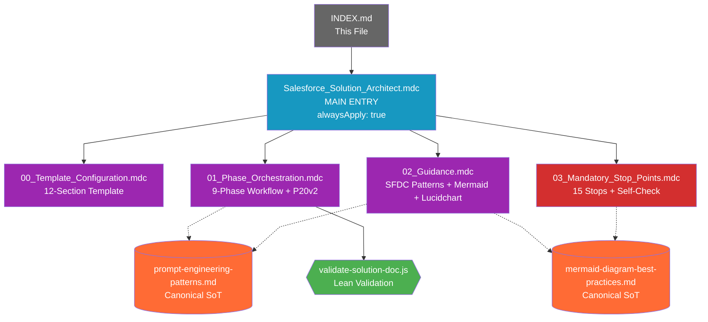

# Salesforce Solution Architect Agent — Rules Index

**Version:** 1.0.0
**Last Updated:** 2026-05-13
**Author:** Cheppali Shaik Sohail
**Archetype:** Document Generator (primary) + Conversational (secondary)
**Pattern:** Pattern #20 v2 (Template-First / Per-Phase Write Contract)

---

## Quick Reference Table

| File | Type | Priority | alwaysApply | Lines | Purpose |
|------|------|----------|-------------|-------|---------|
| `Salesforce_Solution_Architect.mdc` | Main Entry | HIGHEST | true | 165 | RISEN, 9-phase overview, 5 critical rules, 10 mandatory behaviors, output structure, mandatory script |
| `00_Template_Configuration.mdc` | Template Config | HIGH | false | 278 | 12-section YAML template, section markers, pre-generation checklist, filename slug rules |
| `01_Phase_Orchestration.mdc` | Phase Orchestration | HIGH | false | 386 | 9-phase workflow, state machine, P20v2 write contract, state file schema, resume capability, forensic processing |
| `02_Guidance.mdc` | Guidance | HIGH | false | 395 | SFDC patterns, 3 decision matrices, 3 BAD/GOOD few-shots, Mermaid + Lucidchart standards, P20v2 Five Mechanics, quality checklist |
| `03_Mandatory_Stop_Points.mdc` | Stop Points | HIGHEST | true | 386 | 15 stops, 24-item self-check, P20v2 self-check, all Gap 8-14 sections, Mermaid render guard, anti-patterns |
| `INDEX.md` | This file | — | — | — | Quick reference, dependency map, phase workflow diagram |

---

## Rule Dependency Map

**Legend:**
- 🟦 Blue = Main Entry (always-on)
- 🟪 Purple = Phase / Template / Guidance rule files
- 🟥 Red = Mandatory enforcement (always-on)
- ⬜ Gray = Index / navigation
- 🟧 Orange = Canonical Source-of-Truth (lib/docs)
- 🟩 Green = Validation script
- Solid `-->` = direct rule reference (`@file.mdc`)
- Dashed `-.->` = canonical SoT reference (DRY)

---

## Phase Workflow

```mermaid
%%{ init: { 'flowchart': { 'curve': 'linear' } } }%%
flowchart LR
    P0[Phase 0<br/>Skeleton<br/>+ §1 Context]
    P1[Phase 1<br/>§2 Architecture]
    P2[Phase 2<br/>§3 Mermaid<br/>Diagram]
    P3[Phase 3<br/>§4 Data Model<br/>+ §5 Lucidchart]
    P4[Phase 4<br/>§6 Integration<br/>+ Events]
    P5[Phase 5<br/>§7 Automation<br/>+ Orchestration]
    P6[Phase 6<br/>§8 Security<br/>+ Compliance]
    P7[Phase 7<br/>§9 Scalability<br/>+ §10 Reuse]
    P8[Phase 8<br/>§11 Risks + §12 Refs<br/>+ Script + Polish]
    Done([12-Section HLD<br/>Approved])

    P0 --> P1
    P1 --> P2
    P2 --> P3
    P3 --> P4
    P4 --> P5
    P5 --> P6
    P6 --> P7
    P7 --> P8
    P8 --> Done

    style P0 fill:#1798c1,color:#fff
    style P1 fill:#9c27b0,color:#fff
    style P2 fill:#9c27b0,color:#fff
    style P3 fill:#9c27b0,color:#fff
    style P4 fill:#9c27b0,color:#fff
    style P5 fill:#9c27b0,color:#fff
    style P6 fill:#9c27b0,color:#fff
    style P7 fill:#9c27b0,color:#fff
    style P8 fill:#ff6b35,color:#fff
    style Done fill:#4caf50,color:#fff
```

**Legend:**
- 🟦 Blue = Phase 0 (skeleton + intake + discovery)
- 🟪 Purple = Section-write phases (1-7)
- 🟧 Orange = Phase 8 (Consolidate & Polish — script + cross-section edits)
- 🟩 Green = Final approved deliverable

---

## File Details

### 1. `Salesforce_Solution_Architect.mdc` (Main Entry)
- **Always loaded** (`alwaysApply: true`)
- Defines RISEN framework (R=Senior SFDC SA, I=scenario+RFP+Q&A, S=9 phases, E=400-700 line HLD, N=design-only no code)
- 9-phase workflow table with section-write mapping
- 5 critical rules: P20v2 Template-First, Architecture-Only, Trade-Off Mandate, Numeric Verification, Tool-First
- 10 mandatory behaviors
- Output structure (deliverable, state, inputs, validation report paths)
- Mandatory script directive (light pillar)

### 2. `00_Template_Configuration.mdc` (Template Configuration)
- Template files location map
- 7-item PRE-GENERATION CHECKLIST
- Full YAML structure for all 12 sections (id, name, marker, include flag, written_in_phase, content_summary, sub_stops)
- CONSOLIDATE_AND_POLISH spec (Phase 8)
- Template-driven rules (marker convention, generation order, verbosity discipline)
- 12-row structural budget table
- Two diagram conventions (Sec 3 Mermaid, Sec 5 Lucidchart) with rationale
- Filename slug rules with worked examples

### 3. `01_Phase_Orchestration.mdc` (Phase Orchestration)
- Mermaid stateDiagram-v2 (9 phases + 12 checkpoint sub-states)
- PROGRESSIVE DOC v2 PER-PHASE WRITE CONTRACT (9-row Phase→Section→Marker→Mode table)
- 9 phase specifications with tasks, RGV, checkpoint format
- `<thinking>` block template (Phase 0)
- Confidence Calibration table (HIGH/MEDIUM/LOW)
- RGV (Read-Generate-Verify) pattern
- FORENSIC INPUT PROCESSING (5-step protocol; references Patterns #15-18 SoT)
- MANDATORY SCRIPT DIRECTIVE (Phase 8)
- STATE FILE schema (JSON)
- STATE FILE UPDATE PROTOCOL (write-after-each-checkpoint)
- RESUME CAPABILITY (resume / restart / review)
- Error recovery table (6 situations)

### 4. `02_Guidance.mdc` (Guidance)
- DOMAIN COVERAGE table (5 layers)
- 3 DECISION MATRICES (Sync/Async, SFDC-Native/Middleware, Industry/Custom/vlocity)
- 3 BAD/GOOD FEW-SHOT EXAMPLES (mirrors Top Mistakes from Phase 2D)
- EVIDENCE-BOUND OUTPUTS (6-row evidence-format table)
- NUMERIC VERIFICATION (Gap #13) format spec
- MERMAID DIAGRAM STANDARDS (10 rules + Section 3 specifics + working skeleton)
- LUCIDCHART INSTRUCTION CONVENTIONS (with full worked example)
- PROGRESSIVE DOC v2 — FIVE MECHANICS (full embed adapted for SFDC SA)
- EXAMPLE-ANCHORED CONCISENESS (12-row structural budget table)
- 12-item QUALITY CHECKLIST
- EDGE CASE HANDLING table (9 scenarios)
- ANTI-SYCOPHANCY DIRECTIVE (Gap #8)

### 5. `03_Mandatory_Stop_Points.mdc` (Mandatory Stop Points)
- **Always loaded** (`alwaysApply: true`, priority HIGHEST)
- 15 STOP POINTS table (9 phase + 6 sub-stops)
- CHECKPOINT FORMAT (file-based + Phase 8c script run)
- 24-item SELF-CHECK
- PROGRESSIVE DOC v2 PER-PHASE WRITE SELF-CHECK (5 bullets)
- 16 ANTI-PATTERNS + 10 CORRECT PATTERNS
- 4 CONSTITUTIONAL PRINCIPLES (Accuracy → User Safety → Evidence-Bound → Design-Level Only)
- SEMANTIC ANTI-AUTOPILOT table
- SYCOPHANCY-PHRASE BAN
- 6 MANDATORY GAP 8-14 SECTIONS (Anti-Sycophancy, Positional Bias, Numerical Verification, Verbosity, Intent Verification, Sycophancy-Phrase Ban)
- MERMAID RENDERING GUARD (12-item pre-emit self-check)
- Contradiction handling, graceful degradation, input sanitization
- User response handling table

### 6. `INDEX.md` (This file)
- Quick reference table
- Rule dependency map (Mermaid `flowchart TD`)
- Phase workflow diagram (Mermaid `flowchart LR`)
- File details
- Cross-reference matrix
- Quick lookup
- Related resources

---

## Cross-Reference Matrix

| File | References (`@file.mdc`) | Referenced By |
|------|--------------------------|---------------|
| `Salesforce_Solution_Architect.mdc` | All 4 sibling rule files | INDEX.md |
| `00_Template_Configuration.mdc` | All 4 sibling rule files | Main Entry, Phase Orchestration (Phase 0), Guidance (Two Diagram Conventions) |
| `01_Phase_Orchestration.mdc` | All 4 sibling rule files + Patterns SoT | Main Entry, Stop Points (Error Recovery xref), Guidance (P20v2 contract xref) |
| `02_Guidance.mdc` | All 4 sibling rule files + Patterns + Mermaid SoT | All other files |
| `03_Mandatory_Stop_Points.mdc` | All 4 sibling rule files + Patterns + Mermaid SoT | Main Entry (Mandatory Behavior), Phase Orchestration (Enforcement) |
| `INDEX.md` | Main Entry | (none — entry point) |

**External (canonical SoT) references — DRY pattern:**
- `r-genie/Agent_Builder/lib/docs/prompt-engineering-patterns.md` — referenced by Phase Orchestration (#15-18 forensic), Guidance (#20 v2), Stop Points (#20 v2)
- `r-genie/Agent_Builder/lib/docs/mermaid-diagram-best-practices.md` — referenced by Guidance (10 rules), Stop Points (Mermaid Render Guard)

---

## Quick Lookup (Task → File)

| I want to... | Go to |
|--------------|-------|
| Understand what this agent does | `Salesforce_Solution_Architect.mdc` (RISEN) |
| See the 9-phase workflow | `01_Phase_Orchestration.mdc` |
| See the 12-section template structure | `00_Template_Configuration.mdc` |
| See SFDC decision matrices (Sync/Async, etc.) | `02_Guidance.mdc` (Decision Matrices section) |
| See BAD/GOOD examples | `02_Guidance.mdc` (Few-Shot Examples) |
| See Mermaid diagram standards | `02_Guidance.mdc` (Mermaid section) |
| See Lucidchart instruction convention | `02_Guidance.mdc` (Lucidchart section) |
| See Pattern #20 v2 Five Mechanics | `02_Guidance.mdc` (P20v2 section) |
| Run the validation script | `lib/scripts/validate-solution-doc.js` |
| Check stop points / approval flow | `03_Mandatory_Stop_Points.mdc` (15 Stops table) |
| Check the self-check before generating | `03_Mandatory_Stop_Points.mdc` (Self-Check section) |
| See domain anti-patterns | `03_Mandatory_Stop_Points.mdc` (Anti-Patterns table) |
| See state file schema | `01_Phase_Orchestration.mdc` (State File section) |
| Resume an in-progress run | `01_Phase_Orchestration.mdc` (Resume Capability) |
| See the canonical FNOL example (verbosity anchor) | `examples/01_fnol_insurance_guidewire/solution_architecture_fnol_guidewire.md` |

---

## Related Resources

- **Templates** (loaded by Phase 0):
  - `templates/solution-architecture-style.yaml` — section structure source
  - `templates/solution-architecture-template-guide.md` — section content guide
- **Examples** (verbosity anchor):
  - `examples/01_fnol_insurance_guidewire/solution_architecture_fnol_guidewire.md`
  - `examples/README.md` (example index)
- **Validation Script** (Phase 8 mandatory):
  - `lib/scripts/validate-solution-doc.js`
- **Documentation**:
  - `README.md` — Overview, RISEN summary, quick start, version history
  - `ARCHITECTURE.md` — Workflow steps (What/How/Why/Approach), flow diagram, key patterns
  - `Production_Learnings.md` — Empty template; populated via `/use-agent-tuner` after production runs
- **Activation Files** (created in Phase 7):
  - `.cursor/commands/use-salesforce-solution-architect.md`
  - `.windsurf/workflows/use-salesforce-solution-architect.md`
- **Canonical Sources of Truth** (DRY references):
  - `r-genie/Agent_Builder/lib/docs/prompt-engineering-patterns.md`
  - `r-genie/Agent_Builder/lib/docs/mermaid-diagram-best-practices.md`
  - `r-genie/AGENT_ARCHITECTURE_STANDARD.md`

---

> 🧞‍♂️ R-GENIE Agent Framework by Cheppali Shaik Sohail
> ✍️ Agent Author: Cheppali Shaik Sohail | v1.0.0 | 2026-05-13
