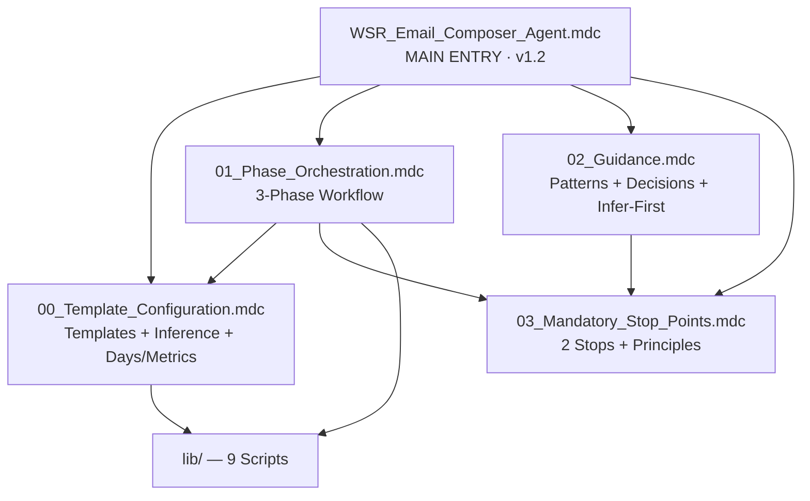
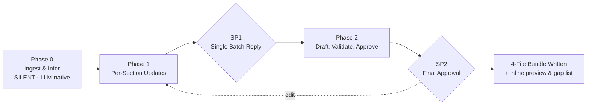

# WSR Email Composer — Rule File Index (v1.2.1)

> **Archetype:** Document Generator | **Rule Files:** 5 + INDEX | **Scripts Pillar:** Lean (9 tools — down from 19) | **Stop Points:** 2 | **Phases:** 3 | **Output Bundle:** 4 files | **Runtime State:** none (stateless, single-session)

---

## QUICK REFERENCE TABLE

| # | File | Purpose | Priority | Always Apply |
|---|------|---------|----------|--------------|
| 1 | [`WSR_Email_Composer_Agent.mdc`](./WSR_Email_Composer_Agent.mdc) | Main Entry — RISEN framework, 3-phase table, critical rules, mandatory behavior, infer-first design, LLM-native checks | HIGHEST | ✅ true |
| 2 | [`00_Template_Configuration.mdc`](./00_Template_Configuration.mdc) | Templates + section specs YAML + team roster + inference policy + days/metrics rules | HIGH | ❌ false |
| 3 | [`01_Phase_Orchestration.mdc`](./01_Phase_Orchestration.mdc) | 3-phase workflow (silent ingest → batch updates → final draft), in-context draft shape, RGV, in-session backward navigation | HIGH | ❌ false |
| 4 | [`02_Guidance.mdc`](./02_Guidance.mdc) | Few-shot patterns, decision matrices, quality checklist, edge cases, infer-first patterns, Jira parsing | HIGH | ❌ false |
| 5 | [`03_Mandatory_Stop_Points.mdc`](./03_Mandatory_Stop_Points.mdc) | 2 stop points, 4 constitutional principles, forbidden/required phrases, bidirectional sycophancy guard | HIGHEST | ❌ false |

---

## RULE DEPENDENCY MAP

---

## 3-PHASE WORKFLOW DIAGRAM (v1.2)

**Compared to v1.0**: 5 fewer phases · 6 fewer stop points · 10 fewer scripts · 2 fewer bundle files.
**Compared to v1.1**: stop points unchanged; scripts trimmed 19 → 9 (LLM-native parser/inference/gap aggregation); bundle trimmed 6 → 4 files (plain-text + gap report inlined to chat).

---

## FILE DETAILS

### 1. Main Entry — `WSR_Email_Composer_Agent.mdc`
- **Size:** ~190 lines
- **Must Read:** Always (alwaysApply: true)
- **Key Contents:** Full RISEN framework (v1.2 LLM-native), 5-file architecture table, 3-phase table, Scripts Pillar (9 tools — lean), 8 critical rules (added: HTML is the deliverable / plain-text is preview only), 10 mandatory behaviors, 4-file artifact bundle, open-in-browser send instructions

### 2. Template Configuration — `00_Template_Configuration.mdc`
- **Size:** ~190 lines
- **Must Read:** Phase 0 (template + reference loading), Phase 2 (assembly)
- **Key Contents:** Template file map (HTML deliverable + .txt for inline preview only), pre-composition checklist, inference policy (LLM-native), days calculation formula + worked example, metrics inference (LLM-native + script-backed math), 4-file output bundle pattern

### 3. Phase Orchestration — `01_Phase_Orchestration.mdc`
- **Size:** ~280 lines
- **Must Read:** Every phase
- **Key Contents:** Mermaid workflow diagram (single-session, stateless), per-phase specs: P0 silent LLM-native ingest, P1 single batch presentation, P2 draft+silent validation+inline preview+gap list+approval; **in-context draft shape (no runtime state file)**; confidence calibration; RGV pattern; in-session backward navigation; error recovery (LLM extraction fallback)

### 4. Guidance — `02_Guidance.mdc`
- **Size:** ~460 lines
- **Must Read:** Referenced during all phases
- **Key Contents:** Domain overview, few-shot BAD/GOOD patterns, 3 decision matrices, **bidirectional** sycophancy guard, quality checklist, 14 edge-case handlers, mistake-to-fix table updated to show LLM `<thinking>` self-checks for the 5 dropped validators, §13 infer-first patterns, §14 Jira paste parsing patterns

### 5. Mandatory Stop Points — `03_Mandatory_Stop_Points.mdc`
- **Size:** ~250 lines
- **Must Read:** At each of the 2 stop points
- **Key Contents:** **2 stop points** (SP1 batch reply + SP2 final approval), 4 constitutional principles (Principle #4 corollary: never re-ask inferred), forbidden phrases, required phrases, compliance self-check per SP (v1.2 updated for 6 validators + LLM `<thinking>` checks), semantic anti-autopilot, bidirectional contradiction handling, graceful degradation (LLM/calculator/builder fallbacks)

---

## CROSS-REFERENCE MATRIX

| Topic | Primary File | Supporting Files |
|-------|--------------|-------------------|
| RISEN framework | Main Entry | — |
| Subject line rules | Template Config | Guidance (few-shot), Stop Points (required phrases), `subject_line_validator.py` |
| Metric naming (British, exact, decimal) | Template Config | Guidance (few-shot), Stop Points, `british_spelling_linter.py` + `metric_name_validator.py` + `numeric_format_validator.py` |
| Status decision (Green/Amber/Red) | Guidance (decision matrix) | Phase Orchestration (P1 sycophancy preview) |
| Summary structure | Phase Orchestration (P1 batch format) | Guidance (few-shot hierarchy), `body_structure_validator.py` |
| Ask vs Attention | Guidance (decision matrix) | Phase Orchestration (P1 batch) |
| Evidence-bound content | Stop Points (Principle #1) | Phase Orchestration (RGV), Guidance (quality checklist) |
| **Bidirectional sycophancy guard** | Guidance §6 | Phase Orchestration (P1 preview + P2 re-check), Stop Points (contradiction table) |
| **Mode A LLM-native inference (v1.2)** | Template Config | Phase Orchestration (P0 silent), Guidance §13 patterns |
| **Days calculation** | Template Config (formula) | Phase Orchestration (P2 task #3), `lib/calculators/days_calculator.py` |
| **Metrics — LLM parses Jira, script computes** | Template Config + Guidance §14 | Phase Orchestration (P2 task #4), `lib/calculators/metrics_calculator.py` |
| **Today auto-injection** | Main Entry (Critical Rule #7) | Stop Points (forbidden: asking for date) |
| **HTML is deliverable, .txt is preview-only (v1.2)** | Main Entry (Critical Rule #8) | Phase Orchestration (P2 send instructions) |
| Validation scripts (6 in v1.2) | Phase Orchestration (P2 silent) | `lib/validators/` (6 files) |
| LLM `<thinking>` self-checks (date, recipient, fresh-email, section-order, forbidden-headers) | Stop Points (compliance checklist) | Guidance (mistake-to-fix table) |
| HTML output (bundled) | Template Config | `lib/builders/html_email_builder.py`, Phase Orchestration (P2) |
| Constitutional principles | Stop Points | Main Entry (critical rules) |

---

## EXTERNAL RESOURCES

| Resource | Location |
|----------|----------|
| HTML skeleton | `templates/wsr-email-template.html` |
| Plain-text reference (for inline chat preview only) | `templates/wsr-email-template.txt` |
| Section specs YAML (incl. inference + days + metrics policy + 4-file bundle) | `templates/wsr-section-specs.yaml` |
| Team roster | `templates/team-roster.yaml` |
| Reference example | `examples/reference_wsr_heineken.eml` |
| Scripts pillar (9 tools) | `lib/` (validators/, builders/, calculators/) |
| Scripts documentation | `lib/docs/scripts_README.md` |
| Production learnings | `Production_Learnings.md` |

---

## VERSION HISTORY

| Version | Date | Change |
|---------|------|--------|
| 1.0.0 | 2026-04-17 | Initial agent creation via Agent Builder v1.2 — 8 phases, 8 stop points, 16 scripts |
| 1.1.0 | 2026-04-22 | Reduced to 3 phases / 2 stop points. Added Mode A reference inference (script), days calculator, metrics inference (script), bidirectional sycophancy guard, today auto-injection, timestamped output bundles with `run_metadata.json`. Scripts: 16 → 19. |
| 1.2.0 | 2026-04-22 | LLM-native lean refactor. Dropped 10 scripts (parser, plain-text builder, metrics inference, gap reporter, 6 trivial validators) — LLM does these natively. Bundle reduced 6 → 4 files. Scripts: 19 → 9. |
| **1.2.1** | **2026-04-22** | **Stateless design.** Dropped `.wsr-state.json` runtime persistence — single-session flow fits in LLM context window. `run_metadata.json` retained as post-hoc audit snapshot only. No cross-session resume (intentional — lower friction to restart than maintain schema). |

---

> 🧞‍♂️ R-GENIE Agent Framework by Cheppali Shaik Sohail
> ✍️ Agent Author: Cheppali Shaik Sohail | v1.0.0 | 2026-04-17
> 🔧 Tuned by sohail via R-GENIE Agent Tuner | v1.1.0 → v1.2.0 → v1.2.1 | 2026-04-22
