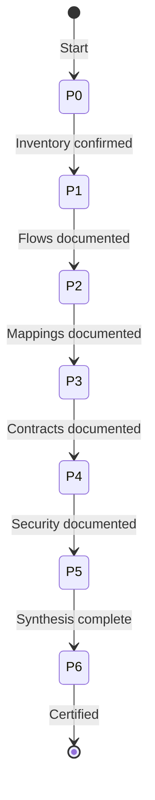

# webMethods Documentation Agent (09) — Architecture

**Version:** 1.0.0
**Author:** MuleSoft PS EMEA
**Archetype:** Analyzer

---

## 1. Purpose

Reverse-engineer AS-IS specifications from webMethods Integration Server project exports. Reads raw project artifacts (FLOW, NDF, IDF, ACL, WSDL, XSD, JAVA, config) directly and produces a comprehensive, count-verified technical specification with zero data loss.

**Primary use cases:**
- Migration documentation (webMethods → MuleSoft or other targets)
- Integration audit and knowledge capture

---

## 2. 4-File Lean Architecture

```
r-genie/WebMethods_Documentation_Agent/
├── rules/
│   ├── WebMethods_Documentation.mdc        # MAIN ENTRY (HIGHEST, alwaysApply)
│   ├── 00_Phase_Orchestration.mdc          # Phase workflow (HIGH)
│   ├── 01_Guidance.mdc                     # Extraction patterns (HIGH)
│   ├── 02_Mandatory_Stop_Points.mdc        # Anti-patterns (HIGHEST, alwaysApply)
│   └── INDEX.md                               # Navigation index
├── examples/
│   └── 01_visualiserPartenaire/               # Reference example output
├── README.md
└── ARCHITECTURE.md
```

### File Responsibility Matrix

| File | Responsibility | Loads |
|------|---------------|-------|
| Main Entry | Identity, RISEN, artifact types, critical rules, output structure | Always |
| Phase Orchestration | 7-phase workflow, per-artifact RGV tasks, checkpoints, state file | On demand |
| Guidance | RGV loop (DRY), classification patterns, extraction by type, few-shot examples | On demand |
| Stop Points | Self-check, anti-patterns, constitutional principles, semantic anti-autopilot | Always |

---

## 3. Core Pattern: RGV Loop (Read-Generate-Verify)

The RGV loop is the central quality mechanism. Defined ONCE in Guidance §1, referenced by all phases:

```
FOR EACH section to generate:
  1. RE-READ  — Fresh Read tool call on relevant artifact files
  2. INVENTORY — Count elements, COMMIT to count N
  3. GENERATE — Produce exactly N items
  4. VERIFY  — Count generated items = N
  5. FIX     — If mismatch → RE-READ, find missing, fix
  6. CHECKPOINT — Emit: ✅ {section}: {Name} — N/N {elements}
```

**Why this matters:**
- LLMs tend to silently drop elements during long extractions
- The INVENTORY → VERIFY cycle catches this before output is finalized
- Micro-checkpoints provide an audit trail for certification

---

## 4. 7-Phase Workflow



| Phase | Name | Core Action | Output Files |
|-------|------|-------------|-------------|
| **0** | Discovery & Planning | Scan, classify, count, reading plan | Main §1-2, component-inventory.md |
| **1** | Flow Documentation | Per-FLOW RGV: all steps with properties + connectivity | Main §3, flow-configuration.md |
| **2** | Mapping & Signatures | Per-NDF RGV: classify subtypes, extract signatures + field mappings | Main §4, service-signatures.md, mapping-tables.md |
| **3** | Contracts & Hierarchy | Per-WSDL/XSD/DocType/IDF RGV: schemas, operations, namespace tree | Main §5, contract-schemas.md |
| **4** | Security & Supporting | Per-ACL/JAVA/config RGV: permissions, code logic, runtime settings | Main §6, security-summary.md |
| **5** | Cross-Artifact Synthesis | Call chain, functional summary, contracts, dependencies, mapping summary | Main §7 |
| **6** | Validation & Certification | RE-READ all files, reconcile counts, gap analysis, certify | Main §8, verification-checklist.md |

### Processing Mode
- **Continuous** — Phases 1-4 auto-proceed with micro-checkpoints
- **User stop at Phase 0** — scope confirmation before deep analysis
- **User stop at Phase 5** — synthesis review before certification
- **User stop at Phase 6** — final acceptance

---

## 5. Output Structure

```
project/output_webmethods/{package_name}/
├── webmethods_specification_{service_name}.md   # Main document (8 sections)
│   ├── §1 Overview
│   ├── §2 Architecture
│   ├── §3 Flow Documentation
│   ├── §4 Service Signatures & Mappings
│   ├── §5 Contracts & Hierarchy
│   ├── §6 Security & Supporting
│   ├── §7 Cross-Artifact Synthesis
│   └── §8 Validation & Certification
├── supporting-docs/
│   ├── component-inventory.md          # Phase 0
│   ├── flow-configuration.md           # Phase 1
│   ├── service-signatures.md           # Phase 2
│   ├── mapping-tables.md               # Phase 2 (ALL field mappings)
│   ├── contract-schemas.md             # Phase 3
│   ├── security-summary.md             # Phase 4
│   └── verification-checklist.md       # Phase 6
└── .webmethods-state.json              # Resume state
```

### Output Separation Principles
- **Main doc** — narrative specification with diagrams and summary tables
- **Supporting docs** — detailed data (all fields, all mappings, all configs)
- **Verification** — counts and certification ONLY in verification-checklist.md
- Main doc cross-references supporting docs with relative links

---

## 6. Artifact Classification Strategy

### Challenge
webMethods uses the same file extension (`node.ndf`) for different object types, and some artifacts lack extensions entirely (`wsdl0`).

### Solution: Content-Based Classification

| Challenge | Strategy |
|-----------|---------|
| NDF subtypes | Read XML content → classify from `svc_type`, `rec_fields`, `parentWsd`, adapter refs |
| Extensionless files | Read first 50 lines → detect `<wsdl:definitions>`, policy structures, etc. |
| XML purpose | Read content → distinguish ACL vs descriptor vs config from root element |

Never classify from file path or extension alone.

---

## 7. Quality Assurance

### Constitutional Principles (Override Order)
1. **ACCURACY** over speed
2. **ZERO ASSUMPTION** over inference
3. **EVIDENCE-BOUND** over assumption
4. **COMPLETENESS** over brevity

### LLM Behavioral Gap Countermeasures

| Gap | Countermeasure | Rule File |
|-----|---------------|-----------|
| Silent element dropping | RGV INVENTORY → VERIFY cycle | Guidance §1 |
| Generating from stale context | Mandatory RE-READ before every section | Guidance §1, Stop Points |
| Summarizing/abbreviating | "Never summarize" + few-shot bad/good examples | Guidance §6, Stop Points |
| Assuming from path | Content-based classification mandate | Guidance §2 |
| Autopilot behavior | Semantic anti-autopilot table + forbidden phrases | Stop Points |
| Overconfidence | Confidence calibration (HIGH/MEDIUM/LOW) | Phase Orchestration |
| Missing edge cases | Extensionless file detection, multi-package handling | Guidance §2 |

### Verification Pipeline
1. **Micro-checkpoints** — per section (N/N counts)
2. **Phase checkpoints** — per phase (rollup)
3. **Phase 6 RE-READ** — every artifact re-read for reconciliation
4. **Gap analysis** — referenced-but-missing components detected
5. **Certification** — zero data loss or explicit gap documentation

---

## 8. State Management & Resume

The agent maintains `.webmethods-state.json` for:
- **Resume on interruption** — picks up from last completed phase
- **Audit trail** — records micro-checkpoint counts per phase
- **Multi-package tracking** — per-package state

On activation, checks for existing state file and offers resume or restart.

---

## 9. Multi-Package Support

For projects with multiple packages:
1. Phase 0 scans and identifies all packages
2. Phases 1-4 process each package independently
3. Phase 5 synthesizes across packages (cross-package call chains, shared utilities)
4. Phase 6 validates per-package + cross-package

Output: one folder per package under `project/output_webmethods/`.

---

> 🧞‍♂️ R-GENIE Agent Framework by Cheppali Shaik Sohail
> ✍️ Agent Author: MuleSoft PS EMEA | v1.0.0 | 2026-04-13
