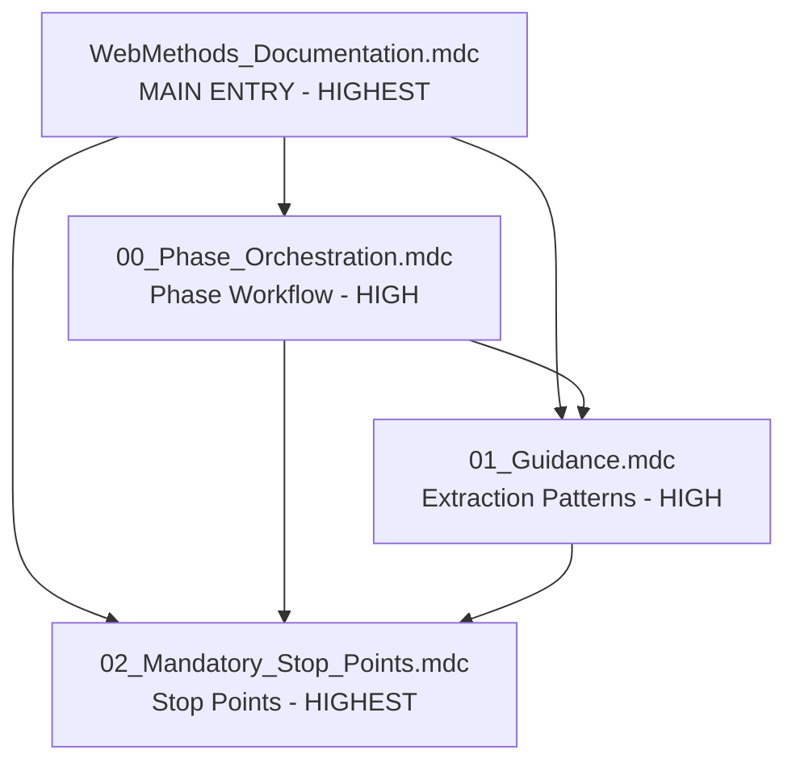
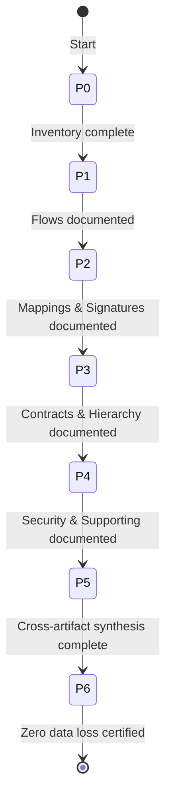

# webMethods Documentation Agent (09) - Rules Index

**Version:** 1.1.0
**Last Updated:** 2026-04-20
**Author:** MuleSoft PS EMEA

---

## Quick Reference Table

| # | File | Purpose | Priority | alwaysApply |
|---|------|---------|----------|-------------|
| 1 | `WebMethods_Documentation.mdc` | **MAIN ENTRY** — RISEN, artifact types, workflow overview, critical rules | HIGHEST | true |
| 2 | `00_Phase_Orchestration.mdc` | 7-phase workflow, per-section RGV loops, checkpoints, state file | HIGH | false |
| 3 | `01_Guidance.mdc` | RGV loop (DRY), artifact extraction patterns (incl. MAP sub-ops/modes, java.frag, Triggers, irtnode_property), few-shot examples, compliance checklist | HIGH | false |
| 4 | `02_Mandatory_Stop_Points.mdc` | Anti-patterns, RGV self-check, constitutional principles, output rules | HIGHEST | true |

---

## Rule Dependency Map

- **Main Entry** references all 3 other files
- **Phase Orchestration** references Guidance (RGV loop) and Stop Points
- **Guidance** references Stop Points (anti-patterns)
- **Stop Points** is self-contained (terminal node)

---

## Phase Workflow

---

## File Details

### WebMethods_Documentation.mdc (MAIN ENTRY)
- **Load:** Always (alwaysApply: true)
- **Contains:** RISEN framework, 4-file architecture, 7-phase overview, artifact type reference, critical rules (extraction method, RGV loop, output separation, zero assumptions), mandatory behavior, output structure
- **Key sections:** RISEN table, Artifact Types (3 categories, 10+ types), Critical Rules, Output Structure

### 00_Phase_Orchestration.mdc
- **Load:** On demand during phase execution
- **Contains:** `<thinking>` block template, confidence calibration, 7 phase definitions with per-artifact RGV loops, checkpoint formats, state file schema, resume capability, error recovery
- **Key sections:** Phase 0-6 detailed tasks, State File Format, Checkpoint Formats

### 01_Guidance.mdc
- **Load:** On demand during extraction phases
- **Contains:** RGV loop (single DRY definition), artifact classification patterns (NDF subtypes incl. REST Resource Handler, Schema-derived DocType, Triggers, extensionless files, java.frag detection, duplicate detection, custom ACL detection, multi-package detection), extraction patterns for 11 artifact types, Tree of Thought, evidence-bound rules, few-shot examples (9 pairs), compliance checklist (24 items), documentation links
- **Key sections:** §1 RGV Loop, §2 Classification (incl. java.frag Detection, Trigger NDF subtype, Duplicate Detection, Custom ACL, Multi-Package), §3 Extraction Patterns (3.1–3.11 incl. MAP sub-ops/modes/mapsource/maptarget/Transformer, irtnode_property, Triggers), §6 Few-Shot Examples (incl. REST Resource, Schema DocType, Custom ACL)

### 02_Mandatory_Stop_Points.mdc
- **Load:** Always (alwaysApply: true)
- **Contains:** Stop point table, ReAct self-check (4 categories), anti-patterns (14 forbidden), correct patterns, constitutional principles (4 ranked), semantic anti-autopilot, contradiction handling, graceful degradation, input sanitization
- **Key sections:** Self-Check, Anti-Patterns, Constitutional Principles

---

## Quick Lookup

| Task | Go To |
|------|-------|
| Understand agent identity and scope | `WebMethods_Documentation.mdc` → RISEN |
| Know which artifact types are supported | `WebMethods_Documentation.mdc` → Artifact Types |
| Execute a specific phase | `00_Phase_Orchestration.mdc` → Phase {N} |
| Apply RGV loop to a section | `01_Guidance.mdc` → §1 |
| Classify an NDF file | `01_Guidance.mdc` → §2 |
| Extract from a specific artifact type | `01_Guidance.mdc` → §3 |
| See good vs bad examples | `01_Guidance.mdc` → §6 |
| Classify a REST resource handler NDF | `01_Guidance.mdc` → §2 (NDF Subtype table) |
| Classify a schema-derived DocType | `01_Guidance.mdc` → §2 (NDF Subtype table) |
| Handle duplicate schemas / .bak files | `01_Guidance.mdc` → §2 (Duplicate Detection) |
| Handle custom ACL names | `01_Guidance.mdc` → §2 (Custom ACL Detection) |
| Process multi-package projects | `01_Guidance.mdc` → §2 (Multi-Package) + §3.9 |
| Extract REST resource handler | `01_Guidance.mdc` → §3.7 |
| Extract schema-derived DocType | `01_Guidance.mdc` → §3.8 |
| Check before generating output | `02_Mandatory_Stop_Points.mdc` → Self-Check |
| Resolve a conflict | `02_Mandatory_Stop_Points.mdc` → Contradiction Handling |
| Handle missing data | `02_Mandatory_Stop_Points.mdc` → Graceful Degradation |

---

## Cross-Reference Matrix

| File | References | Referenced By |
|------|-----------|---------------|
| `WebMethods_Documentation.mdc` | Phase Orch, Guidance, Stop Points | — (entry point) |
| `00_Phase_Orchestration.mdc` | Guidance §1 (RGV), Stop Points | Main Entry |
| `01_Guidance.mdc` | Stop Points | Main Entry, Phase Orch |
| `02_Mandatory_Stop_Points.mdc` | Phase Orch (error recovery) | Main Entry, Phase Orch, Guidance |

---

## Related Resources

| Resource | Location |
|----------|----------|
| Example outputs | `examples/` |
| Production learnings | `Production_Learnings.md` |
| README | `README.md` |
| Architecture | `ARCHITECTURE.md` |

---

> 🧞‍♂️ R-GENIE Agent Framework by Cheppali Shaik Sohail
> ✍️ Agent Author: MuleSoft PS EMEA | v1.0.0 | 2026-04-13
