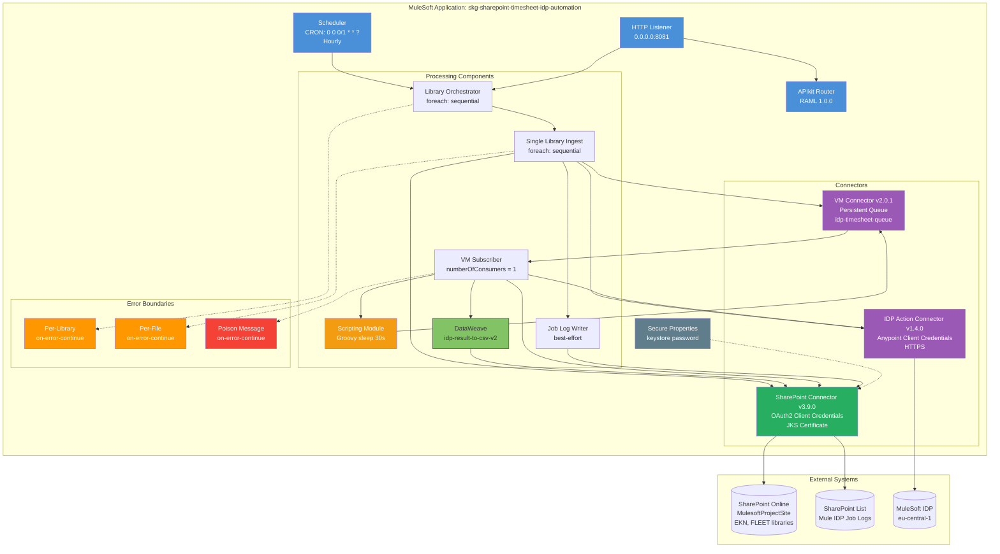
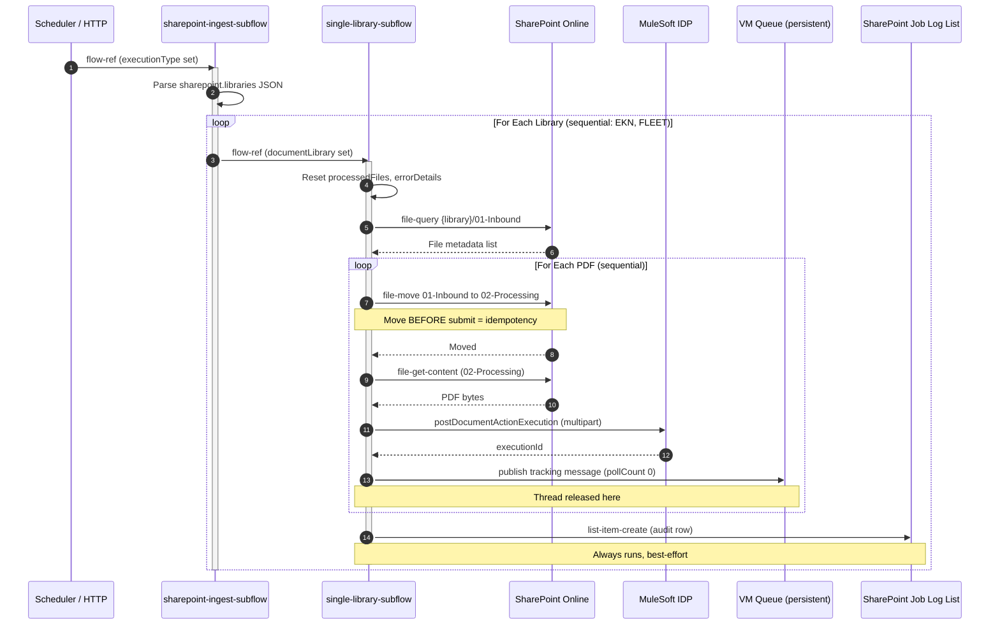
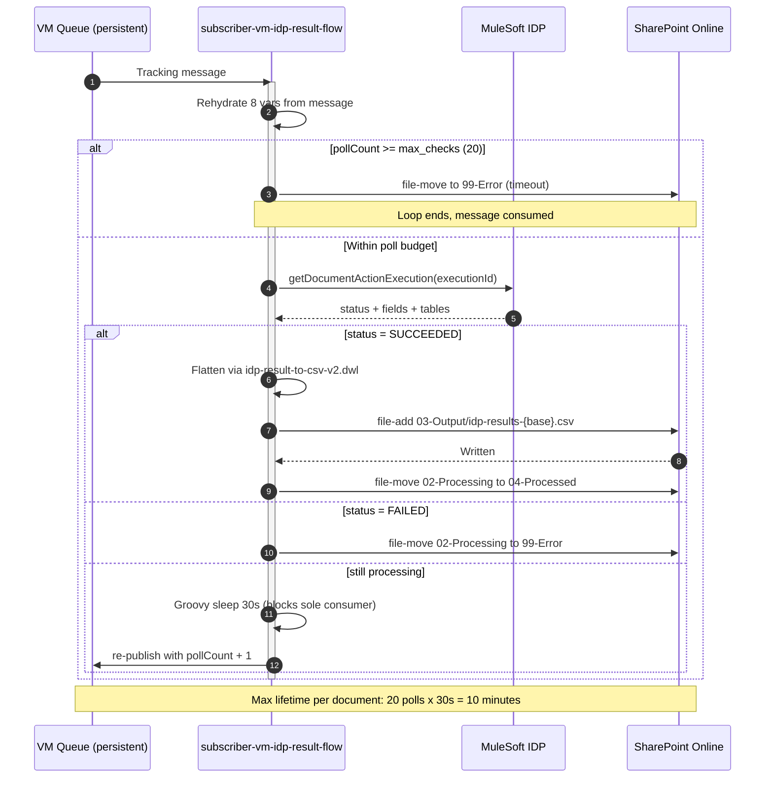
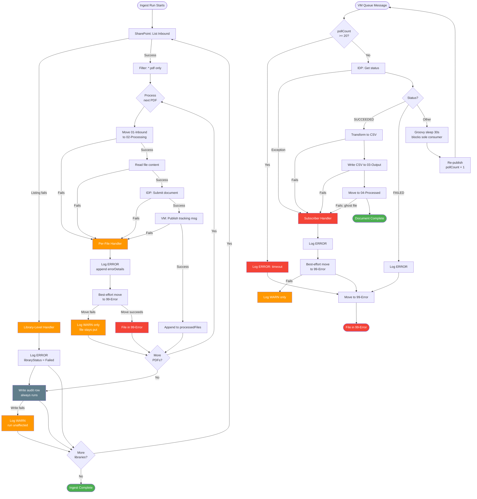

# SKG SharePoint Timesheet IDP Automation - MuleSoft Technical Design

**Project:** SKG SharePoint Timesheet IDP Automation
**Application:** `skg-sharepoint-timesheet-idp-automation` v1.0.0
**Integration:** Microsoft SharePoint Online → MuleSoft IDP → Microsoft SharePoint Online
**Processing:** Scheduled ingestion with asynchronous queue-based result polling
**Runtime:** Mule 4.11.0
**Document Type:** As-built (reverse-engineered from the implemented application)
**Date:** 2026-08-25

> **Status:** ✅ Core design complete — all 5 core sections populated and verified, with the 3
> essential diagrams embedded contextually. Supplementary sections (Security, Performance &
> Monitoring, Configuration Files, Additional Diagrams) pending.
> **Source of truth:** `src/main/mule/**`, `src/main/resources/**`, `pom.xml`. Where this document
> and the code disagree, the code is correct and the discrepancy is a documentation defect.
> **Scope note:** This document was produced by reading the application only. No file under `src/`
> was modified in its creation.

---

## 1. Project Overview

### 1.1 Business Context

SKG receives employee timesheets as scanned or exported PDF documents. These arrive in Microsoft
SharePoint Online document libraries that are partitioned by business unit — one document library
per unit (currently `EKN` and `FLEET`) under a single SharePoint site. Historically the data on
those timesheets had to be transcribed by hand into downstream payroll and project-costing
systems, which is slow, error-prone, and does not scale as additional business units are onboarded.

This application automates that transcription end to end. It sweeps each document library on a
schedule, submits every new PDF to MuleSoft Intelligent Document Processing (IDP) for field and
table extraction, and writes the extracted result back into the same library as a flat CSV file
that downstream systems can consume directly. The source PDF is archived on success and quarantined
on failure, so the SharePoint folder structure itself acts as the operational status board.

**Key Business Drivers:**

- Eliminate manual transcription of timesheet PDFs into payroll and project-costing systems
- Onboard additional business units by configuration change only, with no code change
- Keep each business unit's documents and outputs strictly isolated from every other unit's
- Provide an auditable, per-run history of what was processed, by whom, and with what outcome
- Absorb IDP's asynchronous, variable-latency extraction without blocking ingestion threads
- Ensure no document is ever silently lost — every PDF ends in a definitive terminal folder

### 1.2 Integration Scope

| Aspect | Details |
|--------|---------|
| **Source System** | Microsoft SharePoint Online — site `https://skgtechoffice.sharepoint.com/sites/MulesoftProjectSite` |
| **Source Protocol** | SharePoint REST via MuleSoft SharePoint Connector v3.9.0, OAuth 2.0 client credentials with JKS certificate |
| **Source Format** | PDF (filtered case-insensitively on the `sharepoint.filter.extension` property) |
| **Source Location** | `{documentLibrary}/01-Inbound` — swept for every library in `sharepoint.libraries` |
| **Document Libraries** | `EKN`, `FLEET` — supplied as a JSON array string, parsed at runtime |
| **Extraction Engine** | MuleSoft IDP, host `idp-rt.eu-central-1.eu1.anypoint.mulesoft.com:443` (HTTPS) |
| **Extraction Connector** | Exchange-generated IDP action connector, namespace `idp-timesheet-140`, version 1.4.0 |
| **Target System** | Microsoft SharePoint Online — the same document library the source file came from |
| **Target Format** | CSV, one row per timesheet line item, header row included |
| **Target Location** | `{documentLibrary}/03-Output/idp-results-{documentBaseName}.csv` |
| **Audit Target** | SharePoint list `Mule IDP Job Logs` (addressed by GUID `89ac4892-b04b-41be-a251-f30603af4dad`) |
| **Integration Pattern** | Scheduled batch ingestion, decoupled by a persistent queue, with asynchronous status polling |
| **Triggers** | Hourly cron `0 0 0/1 * * ?`, plus on-demand `GET /trigger-ingest` |
| **Application Layer** | Declared as `System BO` in `common-properties.yaml`; Maven `type` is `process-bo` |
| **Runtime** | Mule 4.11.0, HTTP listener on port 8081 |

### 1.3 Volume and Performance Requirements

| Requirement | Value | Notes |
|-------------|-------|-------|
| **Daily Volume** | ~50 PDF documents per day | ⚠️ **ASSUMPTION** — carried forward from the prior pre-implementation design; never validated against production. Confirm before using for capacity planning. |
| **Document Size** | ~200 KB per PDF | ⚠️ **ASSUMPTION** — same provenance as above |
| **Per-Document Timeout** | 10 minutes | Derived from code: `idp.action.max_checks` (20) × `vm.poll.sleepMillis` (30,000 ms) |
| **Ingestion Concurrency** | Sequential, one document at a time | Both `foreach` scopes are sequential by design, acting as natural throttling |
| **Result Processing Concurrency** | Single consumer | VM listener is fixed at `numberOfConsumers="1"` |
| **Deployment Platform** | CloudHub 2.0 Private Space | Per the original solution design document |
| **Replica Count** | Strictly 1 replica | **Mandatory constraint, not a preference** — persistent VM queues on CloudHub 2.0 are bound to local worker storage and cannot replicate state across replicas. A second replica would create an isolated queue whose in-flight documents no other replica can see. |
| **Resource Sizing** | 0.1 – 0.2 vCore | Recommended range, scaled to document weight |
| **Scheduler State (dev)** | `stopped` | `dev-properties.yaml` disables the cron trigger; `common-properties.yaml` defaults to `started` for other environments |

### 1.4 Key Functional Requirements

Each requirement below is traceable to the specific flow or element that implements it. Priorities
reflect operational impact if the behaviour were absent.

| ID | Requirement | Priority | Implemented By |
|----|-------------|----------|----------------|
| **FR-01** | Sweep all configured document libraries on an hourly schedule | HIGH | `scheduler-sharepoint-ingest-flow`, cron `0 0 0/1 * * ?` |
| **FR-02** | Allow on-demand ingestion without waiting for the next cron window | MEDIUM | `trigger-ingest-flow`, `GET /trigger-ingest` |
| **FR-03** | Process an arbitrary list of document libraries, sequentially | HIGH | `sharepoint-ingest-subflow`, foreach over `sharepoint.libraries` |
| **FR-04** | Restrict processing to PDF files, matched case-insensitively | HIGH | Foreach collection filter on `sharepoint.filter.extension` |
| **FR-05** | Isolate each file before submission so re-runs cannot double-process it | HIGH | `Move to Processing` — `01-Inbound` → `02-Processing`, `flag="1"` |
| **FR-06** | Submit the PDF to IDP as a multipart upload | HIGH | `postdocumentactionexecution`, `Content-Type: application/pdf` |
| **FR-07** | Hand off execution tracking asynchronously, freeing the ingest thread | HIGH | `Publish to Tracking Queue`, persistent VM queue `idp-timesheet-queue` |
| **FR-08** | Poll IDP for completion without spin-waiting | HIGH | Subscriber `otherwise` branch — Groovy 30s sleep, then re-publish with `pollCount + 1` |
| **FR-09** | Abandon documents that never complete, rather than polling forever | HIGH | `Timeout?` choice — at 20 polls, move to `99-Error` |
| **FR-10** | Flatten the IDP result to CSV and write it to the library's Output folder | HIGH | `idp-result-to-csv-v2.dwl` + `Write CSV to Output`, `overwrite="true"` |
| **FR-11** | Archive the source PDF once its result is safely written | HIGH | `Move to Processed` — `02-Processing` → `04-Processed` |
| **FR-12** | Quarantine documents that IDP explicitly rejects | HIGH | `FAILED` branch → `99-Error` |
| **FR-13** | Prevent one malformed file from aborting the rest of the batch | HIGH | `Isolate Per-File Errors` — `on-error-continue` with best-effort move to Error |
| **FR-14** | Prevent one library's failure from starving the remaining libraries | HIGH | `Isolate Library-Level Errors` — sets `libraryStatus='Failed'`, outer loop continues |
| **FR-15** | Record one audit row per library run, unconditionally | MEDIUM | `write-job-log-subflow`, invoked outside the error boundary so it always runs |
| **FR-16** | Expose health and connectivity endpoints for platform monitoring | MEDIUM | `api.xml` — liveness probe, readiness probe, `/hello`, APIkit router and console |
| **FR-17** | Emit structured, correlation-aware logs at every significant step | MEDIUM | `CustomLogMapper::logger` in all flows, with `correlationId` propagation |

### 1.5 Non-Functional Requirements

| Category | Requirement | Metric | As-Built Target |
|----------|-------------|--------|-----------------|
| **Performance** | Per-document extraction latency | Duration | Bounded at 10 minutes by the poll timeout; typical latency is IDP-dependent |
| **Performance** | Ingestion throughput | Concurrency | Deliberately serialized — sequential foreach plus a single queue consumer |
| **Performance** | Thread efficiency | Blocking | Ingest threads released immediately after queue publish; no thread waits on IDP |
| **Reliability** | Crash and restart recovery | Message durability | Persistent VM queue — in-flight tracking messages survive a worker restart |
| **Reliability** | Duplicate prevention | Idempotency | Guaranteed by moving the file out of `01-Inbound` before any submission |
| **Reliability** | Batch resilience | Blast radius | Two independent error boundaries — per file and per library |
| **Reliability** | Cross-library isolation | Data separation | Each queue message carries its own output, processed, and error paths; no global folder lookup |
| **Reliability** | Audit durability | Coupling | Job-log writes are best-effort — a SharePoint list outage cannot fail an ingest run |
| **Security** | SharePoint authentication | Method | OAuth 2.0 client credentials with JKS certificate (`skg-sp-server.jks`, alias `mule`) |
| **Security** | Credential protection | Encryption | Keystore password encrypted via the Secure Properties module |
| **Security** | Transport | Protocol | HTTPS to both SharePoint and IDP |
| **Observability** | Log structure | Format | Structured JSON with `correlationId`, status, message; payload only at DEBUG |
| **Observability** | Traceability | Granularity | Every ingest and subscriber log line names its document library inline |
| **Maintainability** | Onboarding a library | Change type | Property-only — edit the `sharepoint.libraries` JSON array |
| **Maintainability** | Transform versioning | Convention | New `-vN.dwl` file plus a repointed resource reference, rather than in-place edits |

⚠️ **Test coverage gap:** `src/test/munit/` is empty — the application has no automated tests, even
though MUnit tooling is wired into the Maven build. Every functional requirement above is currently
verified by manual execution only.

⚠️ **Environment readiness gap:** only `dev-properties.yaml` is populated. `test-properties.yaml`
and `prod-properties.yaml` are empty, and `preprod-properties.yaml` sets nothing but HTTP and HTTPS
ports. Deploying to any environment other than `dev` would fail at startup on unresolved
SharePoint, IDP, and VM properties.

---

## 2. Technical Architecture

### 2.1 Architecture Pattern

**As Implemented:** Single self-contained application — no API-led layering

The application is one deployable Mule artifact that owns the entire document lifecycle from
SharePoint pickup through IDP extraction to SharePoint write-back. It does not call any other
MuleSoft API, and no other API calls it for business functionality. The APIkit router present in
`api.xml` serves only operational endpoints (`/hello`, liveness probe, readiness probe) and the
manual ingest trigger — not a consumer-facing business interface.

**Rationale evident in the implementation:**

- The unit of work is a document, sourced from and returned to the same system (SharePoint), so
  there is no second system of record to justify a System API boundary
- All orchestration is internal and linear, so a Process API layer would add deployment surface
  without adding capability
- The declared layer is `System BO` in `common-properties.yaml`, while the Maven `type` property
  is `process-bo` — the artifact behaves as a self-contained utility regardless of which label
  is read
- Externalized properties, not code, define which document libraries exist, which keeps the
  single-artifact model viable as business units are added

**Structural decomposition** — eight flows and three sub-flows across four XML files:

| File | Contents |
|------|----------|
| `api.xml` | APIkit router and console, `/hello`, two health probe flows, `trigger-ingest-flow`, `scheduler-sharepoint-ingest-flow` |
| `config/global.xml` | Property loading, all connector configurations, imports of the external health-check and error-handling XML |
| `implementation/idp-ingest-flow.xml` | `sharepoint-ingest-subflow` (per-library orchestrator), `sharepoint-ingest-single-library-subflow` (worker) |
| `implementation/idp-subscriber-flow.xml` | `subscriber-vm-idp-result-flow` (queue consumer and IDP poller) |
| `implementation/idp-job-logging-flow.xml` | `write-job-log-subflow` (audit row writer) |

Two files exist in the source tree but participate in no flow: `common/common.xml` and
`implementation/skg-sharepoint-example.xml` are leftover template artifacts, neither imported nor
referenced.

### 2.2 Processing Strategy

**As Implemented:** Scheduled batch ingestion, decoupled by a persistent queue, with asynchronous
polling for extraction results

| Aspect | Details |
|--------|---------|
| **Strategy** | Two-stage: synchronous ingestion stage, then asynchronous result stage, joined by a persistent VM queue |
| **Stage 1 trigger** | Hourly cron, or on-demand HTTP call |
| **Stage 1 concurrency** | Fully sequential — outer foreach over libraries, inner foreach over files |
| **Stage 2 trigger** | VM queue message arrival |
| **Stage 2 concurrency** | Single consumer (`numberOfConsumers="1"`) |
| **Queue** | `idp-timesheet-queue`, persistent, declared in `VM_Config` |
| **Poll throttle** | Groovy `sleep(30000)` via the Scripting module, executed inside the consumer before re-publishing |
| **Poll ceiling** | 20 attempts, then the document is quarantined |
| **Resource constraint** | 0.1 – 0.2 vCore, exactly 1 replica |

**Why the queue exists.** IDP extraction is asynchronous and of unpredictable duration. A
synchronous design would hold an ingestion thread open for the full extraction, which at 0.1–0.2
vCore would exhaust the thread pool within a handful of concurrent documents. Publishing a tracking
message and returning releases the ingestion thread in milliseconds, so the number of documents
in flight is bounded by queue depth rather than by thread count.

**Key design decisions read from the code:**

- **Move before submit.** The file leaves `01-Inbound` before IDP is called. If the next scheduled
  run fires while the current batch is still working, the earlier file is no longer visible to it,
  so duplicate submission is structurally impossible rather than defended against with state flags.
- **Self-describing queue messages.** Each tracking message carries `documentLibrary`, `outputPath`,
  `processedPath`, and `errorPath` — the consumer never resolves a folder from a global property.
  This is what makes cross-library mixing impossible, and it means raising the consumer count above
  1 would not introduce a correctness risk (though the single-replica constraint remains).
- **Re-publish rather than loop.** A still-processing document is not retried inside the flow; it is
  put back on the queue with `pollCount + 1`. Poll state therefore lives in the durable message, not
  in memory, so a restart resumes polling at the correct attempt number.
- **Sequential as throttle.** Neither foreach is parallel. Sequential execution is the throttling
  mechanism, keeping SharePoint and IDP request rates predictable on fractional vCores.
- **Nested error boundaries.** A per-file boundary sits inside a per-library boundary, so the blast
  radius of a failure is one document, or at worst one library.

### 2.3 Connector Summary

| Connector | Version | Configuration | Purpose |
|-----------|---------|---------------|---------|
| **HTTP Listener** | 1.11.1 | `HttpListenerConfig`, host `0.0.0.0`, port `${http.port}` (8081) | Serves `/api/v1/*`, `/console/*`, `/trigger-ingest` |
| **APIkit** | 1.11.11 | `api-config`, RAML `skg-idp-automation-template-papi:1.0.0` from Exchange, `outboundHeadersMapName`, `httpStatusVarName` | Routes operational endpoints to their flows |
| **Scheduler** | core | Cron `${scheduler.cron}`, initial state `${scheduler.initialState}` | Hourly ingestion trigger |
| **SharePoint** | 3.9.0 | `Sharepoint_Sharepoint_online`, OAuth 2.0 client credentials, JKS keystore `skg-sp-server.jks`, alias `mule`, type `JKS` | All file and list operations |
| **IDP Action** | 1.4.0 | `IDP___Timesheet___1_4_0_Config`, host, port, protocol, Anypoint client id and secret | Document submission and status retrieval |
| **VM** | 2.0.1 | `VM_Config`, queue `${vm.queue.name}`, persistent | Async tracking handoff between the two stages |
| **Scripting (Groovy)** | 2.1.1 | Inline `sleep(${vm.poll.sleepMillis} as long)` | Throttles the poll loop |
| **Secure Properties** | (parent-managed) | `Secure_Properties_Config`, file `properties/secure/${mule.env}-secure-properties.yaml`, key `${mule.secure.key}` | Decrypts the keystore password |
| **HTTP Request** | 1.11.1 | `HttpHealthCheckRequestConfig`, `HttpsHealthCheckRequestConfig`, host/port/basePath bound to payload expressions | Consumed by the imported health-check flows |

**SharePoint operations in use:**

| Operation | Used By | Purpose |
|-----------|---------|---------|
| `file-query` | Ingest worker | Lists Inbound files, selecting `Name`, `ServerRelativeUrl`, `Length`, `TimeLastModified` |
| `file-get-content` | Ingest worker | Reads PDF bytes for the IDP upload |
| `file-move` | Ingest worker, subscriber | All four folder transitions, always with `flag="1"` (overwrite) |
| `file-add` | Subscriber | Writes the CSV result with `overwrite="true"` |
| `list-item-create` | Job log writer | Appends one audit row, addressed by list GUID |

**IDP operations in use:**

| Operation | Used By | Purpose |
|-----------|---------|---------|
| `postdocumentactionexecution` | Ingest worker | Multipart upload of the PDF; returns the execution id as `payload.id` |
| `getdocumentactionexecution` | Subscriber | Returns execution `status` plus extracted `fields` and `tables` |

⚠️ **Inert configuration:** `idp.action.id` and `idp.action.version` are defined in
`dev-properties.yaml` but are referenced **nowhere** in any flow or DataWeave file. The target IDP
action is baked into the Exchange-generated connector asset itself (Maven artifact
`mule-plugin-idp-action-3dd6703a-e0b2-4f26-ab56-4e0d7dacfd9d:1.4.0`), so changing these two
properties has no effect on runtime behaviour. Only `idp.action.max_checks` is actually read.
Retargeting a different IDP action requires swapping the connector dependency, not editing properties.

⚠️ **Unused namespace:** `global.xml` and both implementation files declare the
`idp-timesheet-130` namespace and schema location alongside `idp-timesheet-140`. No `130` element
or configuration exists anywhere — it is a residue of the 1.3.0 → 1.4.0 connector upgrade.

⚠️ **Unused properties:** `api.id`, `https.port`, and `http.private.port` are defined in
`common-properties.yaml` but referenced by no flow or connector configuration.

### 2.4 Connector Pattern Diagram



**Reading the diagram:** solid arrows are the normal execution path; dashed arrows are error
containment relationships. Note that `VM_CONN` appears on both sides of `SUBSCRIBER` — the consumer
both reads from and re-publishes to the same queue, which is the poll loop.

---

## 3. Flow Architecture

The call chain is four levels deep. An entry point sets `executionType`, then delegates to the
orchestrator, which sets `documentLibrary` per iteration and delegates to the worker, which does
the per-file work and finally calls the job log writer. Because Mule sub-flows share the caller's
variable scope and take no formal parameters, setting a variable immediately before the `flow-ref`
is the mechanism by which values are passed down this chain.

```
Entry point (sets executionType)
  └─ sharepoint-ingest-subflow (sets documentLibrary, loops libraries)
       └─ sharepoint-ingest-single-library-subflow (loops files, submits to IDP)
            └─ write-job-log-subflow (one audit row)

[persistent VM queue boundary]

subscriber-vm-idp-result-flow (independent consumer, polls IDP, finalizes files)
```

### 3.1 Entry Point Flows

Both ingest entry points converge on the same sub-flow name, differing only in trigger and in the
`executionType` value they stamp on the run.

**Flow Name:** `scheduler-sharepoint-ingest-flow`

| Step | Component | Action | Details |
|------|-----------|--------|---------|
| **1** | Scheduler | Trigger on schedule | Cron `${scheduler.cron}` = `0 0 0/1 * * ?` (hourly, on the hour). Initial state `${scheduler.initialState}` — `stopped` in dev, `started` by default elsewhere |
| **2** | Transform Message | Build run marker payload | JSON with message, `now()` timestamp, status `active`, environment |
| **3** | Set Variable | `executionType` = `Scheduled` | Consumed later by the job log writer |
| **4** | Flow Reference | Invoke orchestrator | `sharepoint-ingest-subflow` |

**Flow Name:** `trigger-ingest-flow`

| Step | Component | Action | Details |
|------|-----------|--------|---------|
| **1** | HTTP Listener | Accept request | Path `/trigger-ingest` on `HttpListenerConfig` |
| **2** | Set Variable | `correlationId` | From header `x-correlation-id`, falling back to the runtime-generated `correlationId` |
| **3** | Logger | Log request context | INFO, emitted **before** any transform so HTTP `attributes` (method, URI, query and URI params) are still available |
| **4** | Transform Message | Build acknowledgement payload | JSON with message, timestamp, status, environment |
| **5** | Set Variable | `executionType` = `Manual` | Distinguishes on-demand runs in the audit list |
| **6** | Flow Reference | Invoke orchestrator | `sharepoint-ingest-subflow` |

⚠️ **The manual trigger is synchronous.** `trigger-ingest-flow` has no `<async>` scope, so the HTTP
caller's connection stays open for the entire sweep of every configured library — including all
SharePoint moves and IDP submissions. The HTTP response body is whatever the payload happens to be
when the sub-flow chain returns, not the acknowledgement JSON built at step 4. With a large Inbound
backlog this call can exceed client and load-balancer timeouts. Note that only *submission* is
synchronous; extraction results are still processed asynchronously by the subscriber.

**Operational endpoints** — routed by APIkit, not part of the ingest path:

| Flow | Endpoint | Purpose |
|------|----------|---------|
| `skg-idp-automation-template-papi-main` | `/api/v1/*` | APIkit router entry; sets `correlationId`, logs, delegates to the RAML-matched flow; error handler `common-error-handling` |
| `skg-idp-automation-template-papi-console` | `/console/*` | APIkit console |
| `get:\hello:api-config` | `GET /api/v1/hello` | Connectivity smoke test |
| `get:\health-check\liveliness-probe:api-config` | `GET /api/v1/health-check/liveliness-probe` | Delegates to imported `health-liveness-probe` |
| `get:\health-check\readiness-probe:api-config` | `GET /api/v1/health-check/readiness-probe` | Delegates to imported `health-readiness-probe` |

The probe flows and `common-error-handling` are not defined in this project. They resolve at build
time from the `skg-health-check-app` and `skg-common-error-handling` Exchange plugins, imported by
`global.xml` as `health-check.xml` and `common-error-handling.xml`.

### 3.2 Document Library Orchestration

**Sub-Flow Name:** `sharepoint-ingest-subflow`

| Step | Component | Action | Details |
|------|-----------|--------|---------|
| **1** | Set Variable | `librariesList` | `read(p('sharepoint.libraries'), 'application/json')` — parses the JSON array string into a list |
| **2** | For Each | Iterate libraries sequentially | Collection `vars.librariesList`, counter variable `libIndex`. Not parallel — deliberate throttling |
| **3** | Set Variable | `documentLibrary` = current element | The parameter-passing mechanism for the next sub-flow |
| **4** | Flow Reference | Invoke the worker | `sharepoint-ingest-single-library-subflow` |

This orchestrator holds no error handler of its own. Failure containment is provided by the try
scopes inside the worker, which is what allows the loop to survive a failing library and continue
to the next one.

### 3.3 Single Library Ingest

**Sub-Flow Name:** `sharepoint-ingest-single-library-subflow`

| Step | Component | Action | Details |
|------|-----------|--------|---------|
| **1-4** | Set Variable ×4 | Reset per-run audit state | `processedFiles = []`, `errorDetails = []`, `libraryStatus = null`, `libraryFailureReason = null`. Reset every invocation, so counts can never leak between libraries |
| **5** | Try | Open library-level boundary | `Isolate Library-Level Errors` — wraps everything through step 15 |
| **6** | Logger | Log ingest start | INFO, names the library and the Inbound folder inline in the message text |
| **7** | SharePoint `file-query` | List Inbound contents | Query `{documentLibrary}/{folder.source}?$select=Name,ServerRelativeUrl,Length,TimeLastModified` |
| **8** | Logger | Log discovery result | INFO with file count; full file-name list only at DEBUG |
| **9** | For Each | Iterate PDFs sequentially | Collection filtered by `lower(file.Name) endsWith ('.' ++ p('sharepoint.filter.extension'))` — case-insensitive, `default []` guards an empty folder |
| **10-11** | Set Variable ×2 | `fileName`, `sourceUrl` | From `payload.Name` and `payload.ServerRelativeUrl` |
| **12-15** | Set Variable ×4 | `processingUrl`, `outputPath`, `processedPath`, `errorPath` | Each composed as `{serverRelativePath}/{documentLibrary}/{folderLeaf}` — computed per library, never hardcoded |
| **16** | Try | Open per-file boundary | `Isolate Per-File Errors` — poison-pill deflection |
| **17** | SharePoint `file-move` | `01-Inbound` → `02-Processing` | `flag="1"` (overwrite). Executed **before** submission, establishing idempotency |
| **18** | SharePoint `file-get-content` | Read PDF bytes | Reads from `processingUrl`, result stored in `vars.fileContent` via `target` |
| **19** | IDP `postdocumentactionexecution` | Submit document | Multipart body: part name `file`, filename `vars.fileName`, `Content-Type: application/pdf`, content `vars.fileContent` |
| **20** | Set Variable | `executionId` = `payload.id` | IDP's handle for this extraction |
| **21** | Transform Message | Build tracking message | JSON: `executionId`, `fileName`, `documentLibrary`, `processingUrl`, `outputPath`, `processedPath`, `errorPath`, `pollCount: 0` |
| **22** | VM `publish` | Hand off asynchronously | Queue `${vm.queue.name}`, persistent. Ingest thread is now free |
| **23** | Logger | Log submission success | INFO, library named inline |
| **24** | Set Variable | Append to `processedFiles` | Feeds the audit row's `FilesProcessed` count and `Details` list |
| **25** | Flow Reference | Write audit row | `write-job-log-subflow` — **outside** the try at step 5, so it always runs |

**Per-file error path** (`on-error-continue`, type `ANY`, at step 16):

| Step | Component | Action | Details |
|------|-----------|--------|---------|
| **E1** | Set Variable | Append to `errorDetails` | Format `"{fileName} ({error.description})"` |
| **E2** | Logger | Log the failure | ERROR, with error type and description at DEBUG |
| **E3** | Try → `file-move` | Best-effort quarantine | `processingUrl` → `{errorPath}/{fileName}`, `flag="1"` |
| **E4** | Inner `on-error-continue` | Swallow move failure | WARN only. Prevents error-handler recursion when the file was never moved out of Inbound |

**Library-level error path** (`on-error-continue`, type `ANY`, at step 5):

| Step | Component | Action | Details |
|------|-----------|--------|---------|
| **L1** | Logger | Log the library failure | ERROR, states explicitly that other libraries will still be processed |
| **L2** | Set Variable | `libraryStatus` = `Failed` | Overrides the count-derived status in the audit row |
| **L3** | Set Variable | `libraryFailureReason` = `error.description` | Becomes the audit row's `Details` |

This boundary catches failures that occur before or during the Inbound listing — for example a
missing library or a SharePoint authentication failure — where no per-file boundary has been entered
yet. Containing it here is what stops one bad library from aborting the orchestrator's loop.

**Sequence Diagram — Ingestion Stage:**



### 3.4 VM Subscriber / IDP Result Polling

**Flow Name:** `subscriber-vm-idp-result-flow`

| Step | Component | Action | Details |
|------|-----------|--------|---------|
| **1** | VM Listener | Consume tracking message | Queue `${vm.queue.name}`, `numberOfConsumers="1"` |
| **2-9** | Set Variable ×8 | Rehydrate context from the message | `executionId`, `fileName`, `processingUrl`, `pollCount` (default 0), `documentLibrary`, `outputPath`, `processedPath`, `errorPath` — every destination comes from the message, never from a property |
| **10** | Choice | `Timeout?` | Condition `vars.pollCount >= p('idp.action.max_checks')` |
| **11** | Logger | Log timeout | ERROR, reports attempt count and the configured ceiling |
| **12** | SharePoint `file-move` | Quarantine on timeout | `processingUrl` → `{errorPath}/{fileName}`, `flag="1"`. Message is consumed, ending the loop |
| **13** | IDP `getdocumentactionexecution` | Poll for result | `execution-id` = `vars.executionId` |
| **14** | Choice | `Evaluate Status` | Three-way branch on `upper(payload.status default '')` |

**Branch `SUCCEEDED`:**

| Step | Component | Action | Details |
|------|-----------|--------|---------|
| **S1** | Set Variable | `outputBaseName` | `(payload.documentName default vars.fileName)` with the extension stripped via `replace /\.[^.]*$/ with ''` |
| **S2** | Transform Message | Flatten to CSV | External resource `dw/idp-result-to-csv-v2.dwl` |
| **S3** | SharePoint `file-add` | Write the result | `{outputPath}/idp-results-{outputBaseName}.csv`, `overwrite="true"` |
| **S4** | SharePoint `file-move` | Archive the source | `02-Processing` → `04-Processed`, `flag="1"` |
| **S5** | Logger | Log success | INFO, names file, library and generated CSV |

The ordering of S3 before S4 matters: the result is durably written before the source PDF is
archived, so a failure between the two leaves the source in `02-Processing` rather than losing it.

**Branch `FAILED`:**

| Step | Component | Action | Details |
|------|-----------|--------|---------|
| **F1** | Logger | Log IDP rejection | ERROR, includes the reported IDP status at DEBUG |
| **F2** | SharePoint `file-move` | Quarantine | `02-Processing` → `99-Error`, `flag="1"` |

**Branch `otherwise`** (any other status — still processing):

| Step | Component | Action | Details |
|------|-----------|--------|---------|
| **P1** | Logger | Log still-processing | DEBUG level, so a normal wait does not generate INFO noise |
| **P2** | Scripting (Groovy) | Throttle | `sleep(${vm.poll.sleepMillis} as long)` = 30 seconds. Blocks the single consumer for the duration |
| **P3** | Transform Message | Increment poll counter | Rebuilds the identical message shape with `pollCount + 1` |
| **P4** | VM `publish` | Re-queue | Back onto the same queue — poll state persists in the message, not in memory |

⚠️ **The throttle blocks the only consumer.** With `numberOfConsumers="1"`, the 30-second Groovy
sleep at P2 halts processing of every other queued message, including ready results from other
libraries. Effective queue throughput is therefore bounded at roughly one message per 30 seconds
whenever any document is mid-extraction.

**Flow-level error path** (`on-error-continue`, type `ANY`):

| Step | Component | Action | Details |
|------|-----------|--------|---------|
| **X1** | Logger | Log unexpected failure | ERROR, with error type and description at DEBUG |
| **X2** | Try → `file-move` | Best-effort quarantine | `processingUrl` → `{errorPath}/{fileName}` |
| **X3** | Inner `on-error-continue` | Swallow move failure | WARN only — handles the ghost-file case where the source was deleted or renamed externally |

**Sequence Diagram — Asynchronous Result Stage:**



### 3.5 Job Log Writer

**Sub-Flow Name:** `write-job-log-subflow`

| Step | Component | Action | Details |
|------|-----------|--------|---------|
| **1** | Try | Open best-effort boundary | `Best-Effort Write Job Log` |
| **2** | SharePoint `list-item-create` | Append one audit row | `listId='${sharepoint.jobLogList.listId}'`, with the eight column values built in DataWeave |
| **3** | `on-error-continue` | Swallow any failure | WARN only — a list outage must never fail an ingest run |

**Status derivation** — computed inside the DataWeave properties expression, not by separate counters:

| Condition | Resulting `Status` |
|-----------|--------------------|
| `libraryStatus` was set to `Failed` by the library-level handler | `Failed` (overrides everything below) |
| `errorCount == 0` | `Success` |
| `errorCount > 0` and `processedCount > 0` | `Partial Success` |
| `errorCount > 0` and `processedCount == 0` | `Failed` |

Counts are `sizeOf(processedFiles)` and `sizeOf(errorDetails)` — derived from the same arrays used to
build the `Details` text, so the numbers and the narrative can never disagree.

A run that finds nothing still writes a row, with `FilesProcessed = 0`, `ErrorCount = 0`,
`Status = Success`, and `Details = "No files found"`. This is an intentional heartbeat confirming the
scheduler fired, not a missing-data bug.

⚠️ **The list is addressed by GUID, not title, and must stay that way.** The connector's
metadata-lookup calls encode a title's spaces correctly as `%20`, but the item-creation
`POST .../lists/getbytitle('...')/Items` call encodes them as `+`. SharePoint's REST API reads that
literally and returns `404 List 'Mule+IDP+Job+Logs' does not exist`. Addressing the list as
`_api/web/lists(guid'...')/Items` avoids the mismatch entirely. The `sharepoint.jobLogList.title`
property is retained for human reference only and appears nowhere except a code comment.

⚠️ **Audit scope is submission, not extraction.** These rows record whether a file was successfully
moved, read, and accepted by IDP — nothing more. Final extraction success or failure happens later
and asynchronously in `subscriber-vm-idp-result-flow`, which writes no audit row at all. Determining
a document's true end-to-end outcome requires correlating `executionId` and `fileName` between the
audit list and the application logs.

---

## 4. Field Mapping Tables

### 4.1 Source to Target Field Mapping

**Source Format:** IDP `getDocumentActionExecution` JSON response. Every extracted leaf is wrapped
in a `{value: …}` object, so the actual data always sits one level below the field name. Document
metadata is at the root, header fields under `fields`, and line items in the `tables.timeSheetData`
array.

**Target Format:** CSV with a header row, one row per line item, document and header fields repeated
on every row.

**Transformation:** Implemented by `dw/idp-result-to-csv-v2.dwl`, referenced from the subscriber's
`SUCCEEDED` branch.

**Document-level fields** — repeated identically on every output row:

| Source Field | Target Column | Transformation | Validation Rules | Notes |
|--------------|---------------|----------------|------------------|-------|
| `id` | `id` | Direct copy | None applied | IDP execution id, the correlation key back to the logs |
| `documentName` | `documentName` | Direct copy | None applied | Original PDF filename as IDP recorded it |
| `status` | `status` | Direct copy | None applied | Always `SUCCEEDED` in practice, since only that branch writes CSV |

**Header fields** — from `fields.{name}.value`, all passed through text cleaning:

| Source Field | Target Column | Transformation | Validation Rules | Notes |
|--------------|---------------|----------------|------------------|-------|
| `fields.lastName.value` | `lastName` | Text cleaning | None applied | |
| `fields.firstName.value` | `firstName` | Text cleaning | None applied | |
| `fields.fullName.value` | `fullName` | Text cleaning | None applied | Supplied by IDP, not derived by concatenation |
| `fields.employeeID.value` | `employeeID` | Text cleaning | None applied | Payroll key, e.g. `KW3404` |
| `fields.timeSheet.value` | `timeSheet` | Text cleaning | None applied | IDP classification flag, string `"True"` not boolean |
| `fields.dateFrom.value` | `dateFrom` | Text cleaning | None applied | `yyyyMMdd`, unseparated, e.g. `20260518`. Not parsed or reformatted |
| `fields.dateTo.value` | `dateTo` | Text cleaning | None applied | `yyyyMMdd`, e.g. `20260522` |
| `fields.tableStructure.value` | `tableStructure` | Text cleaning | None applied | IDP structural-confidence flag, string `"True"` |
| `fields.rawText.value` | *(not mapped)* | — | — | Present in the response, deliberately excluded from output |

**Line-item fields** — from each element of `tables.timeSheetData`:

| Source Field | Target Column | Transformation | Validation Rules | Notes |
|--------------|---------------|----------------|------------------|-------|
| `projectCode.value` | `projectCode` | Text cleaning | None applied | e.g. `B11464` |
| `tradeCode.value` | `tradeCode` | Text cleaning | None applied | e.g. `B01000` |
| `description.value` | `description` | Text cleaning | None applied | Free text, e.g. `AMALINDA 91567` |
| `monTime.value` | `monTime` | Text cleaning, raw string preserved | None applied | Format `"HHMM - HHMM"` |
| `tueTime.value` | `tueTime` | Text cleaning, raw string preserved | None applied | |
| `wedTime.value` | `wedTime` | Text cleaning, raw string preserved | None applied | |
| `thuTime.value` | `thuTime` | Text cleaning, raw string preserved | None applied | See the key-naming note below |
| `friTime.value` | `friTime` | Text cleaning, raw string preserved | None applied | |
| `satTime.value` | `satTime` | Text cleaning, raw string preserved | None applied | |
| `sunTime.value` | `sunTime` | Text cleaning, raw string preserved | None applied | |

**Derived day-split columns** — 4 per day, 28 in total. Each day's `"HHMM - HHMM"` string is decomposed
so downstream payroll systems receive numeric components rather than a string needing parsing:

| Derived Column Pattern | Derivation | Behaviour on Missing or Malformed Input |
|------------------------|------------|------------------------------------------|
| `{day}StartHH` | Characters 1-2 of the range's start half | Empty string |
| `{day}StartMM` | Characters 3-4 of the range's start half | Empty string |
| `{day}EndHH` | Characters 1-2 of the range's end half | Empty string |
| `{day}EndMM` | Characters 3-4 of the range's end half | Empty string |

Generated for all seven day prefixes: `mon`, `tue`, `wed`, `thu`, `fri`, `sat`, `sun`.

**Transformation logic in plain terms:**

| Operation | Behaviour |
|-----------|-----------|
| **Text cleaning** | Newlines and carriage returns are replaced with a single space; backslashes are removed entirely. `null` input yields `null` output rather than an empty string |
| **Time-range splitting** | All spaces are stripped first, so `"0700 - 1100"` and `"0700-1100"` are equivalent. The result is split on the hyphen; the first part is the start, the second the end. Each half must be at least 4 characters or all four derived columns for that day become empty strings |
| **Line-item fan-out** | One output row per `timeSheetData` element. Document and header fields are duplicated across every row, so no join is needed downstream |
| **Empty table handling** | If `timeSheetData` is empty or absent, a single fallback row is emitted instead — see the schema warning in 4.2 |

⚠️ **Thursday key naming — resolved historical discrepancy.** The sample response in
`project/input_01_design` uses the key `thurTime`, while both transforms read `thuTime`. This was
confirmed as a schema rename on the IDP side: the live action emits `thuTime`, and the transforms are
correct. The sample file is stale on this one key. This is recorded because the failure mode is
invisible if it ever recurs — DataWeave returns `null` for a missing key rather than raising an
error, so a future rename would silently empty five columns (`thuTime` plus its four derived
columns) with no log entry and no failed execution.

⚠️ **No confidence scores are captured.** The IDP response carries only `value` per field in the
observed sample. If the action is ever configured to return per-field confidence, those scores are
not read, so a low-confidence OCR guess is written to CSV indistinguishably from a high-confidence one.

### 4.2 Output File Structure

| Attribute | Value |
|-----------|-------|
| **Format** | CSV, comma-separated, header row included |
| **Filename** | `idp-results-{documentBaseName}.csv` |
| **Base name derivation** | `documentName` from the IDP response, falling back to the ingest-time `fileName`, with the final extension stripped by regex |
| **Location** | `{documentLibrary}/03-Output` — the same library the source PDF came from |
| **Write mode** | `overwrite="true"` — a re-run for the same document name replaces the prior result silently |
| **Row cardinality** | One row per `timeSheetData` line item |
| **Column count** | 49 |
| **Encoding** | Mule default; not explicitly set in the transform |

**Column order** — 21 base columns followed by 28 derived columns:

| Position | Columns |
|----------|---------|
| 1-3 | `id`, `documentName`, `status` |
| 4-11 | `lastName`, `firstName`, `fullName`, `employeeID`, `timeSheet`, `dateFrom`, `dateTo`, `tableStructure` |
| 12-14 | `projectCode`, `tradeCode`, `description` |
| 15-21 | `monTime`, `tueTime`, `wedTime`, `thuTime`, `friTime`, `satTime`, `sunTime` |
| 22-49 | For each day in order mon, tue, wed, thu, fri, sat, sun: `{day}StartHH`, `{day}StartMM`, `{day}EndHH`, `{day}EndMM` |

⚠️ **The empty-table fallback emits an incompatible schema.** When `timeSheetData` is empty, the
transform does not emit a 49-column row with blank values. It emits a **4-column** row —
`id`, `documentName`, `status`, `message` — where `message` contains the literal text
`"No timesheet data available"`. The `message` column exists in no other output. Any downstream
consumer that assumes a fixed 49-column header will mis-parse or reject these files. A document
whose extraction succeeded but yielded no line items is a plausible real occurrence (a blank or
unreadable timesheet), so this is a reachable path, not a theoretical one.

### 4.3 Job Log List Mapping

**Target:** SharePoint list `Mule IDP Job Logs`, addressed by GUID. One item created per document-library
run.

| Target Column | Source | Transformation | SharePoint Column Type |
|---------------|--------|----------------|------------------------|
| `Title` | `documentLibrary` + timestamp | Concatenated as `{library}_{yyyy-MM-dd'T'HH:mm:ss}` | Single line of text |
| `ExecutionTime` | `now()` | Formatted as `yyyy-MM-dd'T'HH:mm:ss` string | Single line of text |
| `SourceFolder` | `documentLibrary` | Cast to string | Single line of text |
| `ExecutionType` | `executionType` variable | Defaults to `Manual` if unset | Single line of text |
| `FilesProcessed` | `sizeOf(processedFiles)` | Count, cast to string | Single line of text |
| `ErrorCount` | `sizeOf(errorDetails)` | Count, cast to string | Single line of text |
| `Status` | Derived | `Success` / `Partial Success` / `Failed` per the matrix in 3.5 | Single line of text |
| `Details` | `processedFiles` and `errorDetails` | Newline-joined `"Processed: a, b"` and `"Errors: x (reason); y (reason)"`, or the library failure reason, or `"No files found"` | Multiple lines of text |

⚠️ **Every value must be sent as a string, and the reasons differ per column.** `ExecutionTime`
requires an explicit string cast because a bare DataWeave `now()` passes a raw `ZonedDateTime` into
`output application/java`, which the connector's Jackson mapper cannot serialize — that failure
occurs before any HTTP call is made. `FilesProcessed` and `ErrorCount` require casting for a
different reason: those SharePoint columns are typed "Single line of text", not Number, so raw
integers are rejected by SharePoint itself with
`400 InvalidClientQueryException: Cannot convert a primitive value to the expected type 'Edm.String'`
after the call is made. Both casts are load-bearing and must not be removed.

### 4.4 Validation Rules

The application performs **no data validation** on extracted content. This is a deliberate
characterization of the as-built behaviour, not an omission from this document.

| Gate | Where | What It Actually Checks |
|------|-------|-------------------------|
| **File extension** | Ingest foreach filter | Filename ends with `.pdf`, case-insensitively. The only input validation in the application |
| **IDP execution status** | Subscriber choice router | Routes on `SUCCEEDED` / `FAILED` / anything else. Not content validation — a `SUCCEEDED` extraction with garbage values passes through untouched |
| **Poll ceiling** | Subscriber choice router | Attempt count against `max_checks`. A liveness guard, not a data check |

**What is not validated:**

| Absent Check | Consequence |
|--------------|-------------|
| Mandatory field presence | A document extracting no `employeeID` still produces a CSV, with an empty column |
| Date format or range | `dateFrom` / `dateTo` are copied as raw `yyyyMMdd` strings, never parsed. An impossible or transposed date reaches the CSV unchallenged |
| Time-range plausibility | `"1700 - 1700"` (zero duration) appears in the provided sample and is emitted as-is. Reversed ranges and overnight spans are equally unchecked |
| Time-range wellformedness | A malformed value silently yields four empty derived columns while the raw column retains the malformed text. No log entry marks the discrepancy |
| OCR artifact detection | The sample contains `description` value `"AMALINDA 9157/"` — a trailing slash where a digit belongs. Text cleaning removes backslashes and newlines only, so such artifacts pass straight through |
| Line-item count sanity | A document yielding zero line items produces the incompatible 4-column file described in 4.2 |
| Duplicate document detection | Detection relies solely on the file having been moved out of `01-Inbound`. Re-uploading the same PDF name reprocesses it and overwrites the prior CSV |

**Practical implication.** Data quality is entirely the responsibility of IDP extraction accuracy
and of whatever consumes `03-Output`. Because a document lands in `04-Processed` on the basis of
`status = SUCCEEDED` alone, presence in the Processed folder confirms that extraction ran, not that
the extracted numbers are correct.

---

## 5. Error Handling Strategy

The strategy is containment rather than recovery. Every handler in the application is
`on-error-continue`, and none is `on-error-propagate`. The consistent intent is that a failure
affects the smallest possible unit — one document, or at worst one library — and that the affected
document lands in a folder a human can find.

### 5.1 Error Categories

| Error Category | Error Type | Examples | Severity | Handling | Retry Strategy |
|----------------|------------|----------|----------|----------|----------------|
| **Library-level failure** | `ANY`, caught at `Isolate Library-Level Errors` | Document library renamed or deleted, OAuth token rejected, SharePoint site unreachable at listing time | HIGH | Log ERROR, set `libraryStatus = Failed`, write audit row, continue to next library | None |
| **Per-file ingest failure** | `ANY`, caught at `Isolate Per-File Errors` | Move to Processing fails, file content unreadable, IDP submission rejected, queue publish fails | HIGH | Log ERROR, append to `errorDetails`, best-effort move to `99-Error`, continue to next file | None |
| **Quarantine move failure** | `ANY`, caught by the inner handler | File still in `01-Inbound` because the initial move was what failed; file deleted externally | LOW | Log WARN only; the document remains wherever it currently is | None |
| **IDP explicit failure** | Not an exception — a status value | IDP could not process the document: unsupported layout, corrupt PDF, extraction model failure | HIGH | Log ERROR, move `02-Processing` → `99-Error` | None |
| **Poll timeout** | Not an exception — a counter threshold | Extraction still incomplete after 20 attempts (~10 minutes) | HIGH | Log ERROR, move `02-Processing` → `99-Error` | None — the poll loop *was* the retry |
| **Subscriber runtime failure** | `ANY`, caught by the flow error handler | CSV transform failure, `file-add` failure writing to Output, archive move failure | HIGH | Log ERROR, best-effort move to `99-Error` | None |
| **Ghost file** | `SHAREPOINT:NOT_FOUND` inside the best-effort move | Source PDF deleted or renamed by a user while IDP was extracting | LOW | Log WARN. Note the CSV has already been written, so the extracted data is not lost | None |
| **Audit write failure** | `ANY`, caught in `write-job-log-subflow` | List renamed, GUID changed, column type altered, SharePoint list throttling | LOW | Log WARN. The ingest run is explicitly unaffected | None |
| **Operational endpoint error** | Routed to `common-error-handling` | Malformed request to `/api/v1/*`, APIkit routing failure | MEDIUM | Delegated to the external error-handling plugin | Per plugin |

⚠️ **The ingest entry-point flows have no error handler.** `trigger-ingest-flow` and
`scheduler-sharepoint-ingest-flow` contain no `<error-handler>` element and no
`ref="common-error-handling"`, unlike the APIkit flows. In practice the nested try scopes inside the
sub-flows catch everything, so nothing normally reaches this level — but any failure occurring in the
entry-point flow itself, such as `sharepoint.libraries` containing malformed JSON that fails to
parse, has no handler. For the scheduled flow that surfaces only as a runtime log entry; for the HTTP
trigger it surfaces to the caller as an unshaped 500.

### 5.2 Retry Patterns

**No retry or reconnection strategy is configured anywhere in the application.** Neither the
SharePoint connector, the IDP connector, nor the VM connector declares a `<reconnection>` element or
a `reconnect-forever` policy, and no operation carries a redelivery policy.

| Mechanism | Present? | Detail |
|-----------|----------|--------|
| Connector reconnection strategy | No | No `<reconnection>` element on any connector config |
| Operation-level retry | No | No `until-successful` scope anywhere |
| Redelivery policy | No | No `<redelivery-policy>` on the VM listener |
| Exponential backoff | No | Not configured |
| Queue-level retry | No | A consumed message is not redelivered on failure; the flow handler catches it instead |
| **IDP status poll loop** | **Yes** | The only retry-shaped mechanism: fixed-interval, 30 seconds, ceiling of 20 attempts, state carried in the durable queue message |

**Consequence to understand clearly.** A transient fault is treated identically to a permanent one.
A SharePoint `503 Server Too Busy` during the move to Processing, or a momentary network blip during
`file-get-content`, immediately fails that document and quarantines it in `99-Error`. Recovery is
manual, even though a retry seconds later would very likely have succeeded. The poll loop's fixed
30-second interval is also not a backoff — a document that will take 20 minutes to extract consumes
all 20 attempts and is then quarantined despite IDP still working on it successfully.

⚠️ The prior pre-implementation design specified per-error-type retry tables with exponential
backoff. None of it was implemented. Anyone reading that earlier document should not assume retries
exist in the running system.

### 5.3 Error Handling Flow Details

**Nesting.** Three levels of containment, innermost first:

| Level | Scope | Catches | Effect on the Enclosing Level |
|-------|-------|---------|-------------------------------|
| 1 | Best-effort quarantine move | Failure of the move to `99-Error` | Swallowed with a WARN. Prevents error-handler recursion — the reason it exists |
| 2 | `Isolate Per-File Errors` | Everything about one document | Loop continues with the next file |
| 3 | `Isolate Library-Level Errors` | Everything about one library, including the Inbound listing | Orchestrator loop continues with the next library |

The level-1 boundary is subtle but important. When a document fails *because* its initial move
failed, the file is still in `01-Inbound`, so the quarantine move targeting `02-Processing` also
fails. Without this inner boundary that second failure would escape the error handler and abort the
enclosing loop — the exact outcome the design is built to prevent.

**Audit interaction.** `write-job-log-subflow` is invoked *outside* the level-3 try, which is what
guarantees an audit row for a catastrophically failed library run. Placing it inside would mean the
worst failures produced no record at all.

**Partial failure semantics.** A run is `Partial Success` when at least one file succeeded and at
least one failed. Both the count and the per-file reasons are recorded, so the audit row identifies
exactly which documents need attention rather than merely reporting that something went wrong.

**The one non-idempotent window.** Between the move to `02-Processing` and the queue publish, the
document exists in Processing with no tracking message. If the runtime dies inside that window, the
persistent queue has nothing to replay and the ingest scan will never see the file again — it is no
longer in `01-Inbound`. See 5.5 for detection.

### 5.4 Error Handling Flow Diagram



### 5.5 Error Recovery Procedures

All recovery is manual and folder-driven. There is no automated reprocessing, no reconciliation
sweep, and no alerting integration in the application.

| Scenario | Detection | Recovery Action |
|----------|-----------|-----------------|
| **Document in `99-Error` after IDP failure** | Audit row shows the error, or file present in `99-Error` | Inspect the PDF for quality or layout issues. Move it back to `01-Inbound` to reprocess on the next run |
| **Document in `99-Error` after poll timeout** | Log entry `IDP Subscriber - TIMEOUT` | Check whether IDP eventually completed. If extraction is simply slow, raise `idp.action.max_checks` or `vm.poll.sleepMillis` before retrying; otherwise investigate the document |
| **Document in `99-Error` after a transient fault** | Audit `Details` names the file and reason | Move back to `01-Inbound`. Because no retry exists, transient faults are the most common cause of quarantine and usually succeed on a second pass |
| **Whole library reported `Failed`** | Audit row `Status = Failed`, `Details` prefixed `Library-level failure:` | Verify the library exists with all five subfolders and that the SharePoint credential and certificate are valid. No files were moved, so a re-run is safe |
| **Orphaned file stuck in `02-Processing`** | **Requires an explicit manual check** — see below | Move back to `01-Inbound` to reprocess. Safe as long as no CSV for that document already exists in `03-Output` |
| **Duplicate or stale CSV in `03-Output`** | Unexpected result file | Results are overwritten by document name, so simply reprocessing the source regenerates it |
| **Missing audit row for a run** | Gap in the list | Consult application logs — the audit write is best-effort and may have been WARN-skipped while the run itself succeeded |
| **Runtime restart with documents in flight** | Automatic | No action needed. The persistent queue replays tracking messages and polling resumes at the recorded `pollCount` |

⚠️ **Files stranded in `02-Processing` are invisible to every automated path.** A document is
orphaned if the runtime stopped between its move to Processing and its queue publish, or if its
tracking message was lost. Once orphaned it is no longer in `01-Inbound`, so no ingest scan will
find it, and no queue message exists, so no subscriber will finalize it. It simply sits there
indefinitely. Nothing in the application detects this condition and no alert fires.

Practical mitigation, given no code change is in scope: periodically inspect each library's
`02-Processing` folder and treat any file older than the per-document maximum lifetime — 10 minutes
at current settings, plus a safety margin — as orphaned, then move it back to `01-Inbound`. Before
doing so, check `03-Output` for a matching `idp-results-{name}.csv`; if one exists, the extraction
did complete and only the archive step failed, so the file should be moved to `04-Processed` instead
of being reprocessed.

---
